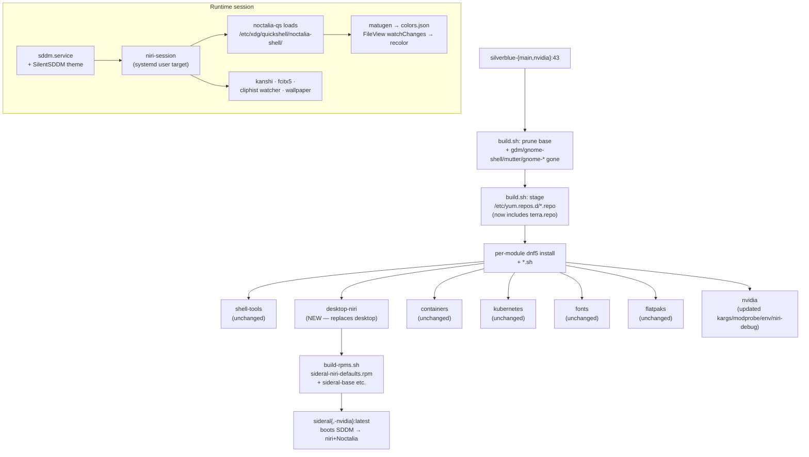

# niri-shell Design

**Spec**: `.specs/features/niri-shell/spec.md`
**Context**: `.specs/features/niri-shell/context.md`
**Status**: Draft

---

## Architecture Overview

niri-shell is a **module-swap** at the desktop layer of sideral's existing two-stage build. The compositor changes from Mutter/GNOME to niri, and the shell changes from gnome-shell-extensions to Noctalia (Quickshell-based, RPM-shipped from Terra). Everything below the desktop layer (CLI tools, podman, K8s, flatpaks, fonts, signing, motd, ujust slot) is unchanged. Everything above (chezmoi user dotfiles) is unchanged.

The build pipeline gains exactly **one** new third-party repo (Terra) shipped via the same persistent-`.repo` pattern already in place for mise/vscode/kubernetes. No COPRs.



---

## Code Reuse Analysis

### Existing Components to Leverage

| Component | Location | How to Use |
|---|---|---|
| Module-walker orchestrator | `os/lib/build.sh` | Add `desktop-niri` to `MODULES`; expand the inherited-base prune list; persistent-repo staging picks up `terra.repo` with no code change. |
| Inline RPM builder | `os/lib/build-rpms.sh` | New `desktop-niri/rpm/sideral-niri-defaults.spec` is auto-discovered (walks `os/modules/*/rpm/*.spec`). |
| Persistent-repo pattern | `os/modules/meta/src/etc/yum.repos.d/{mise,vscode}.repo` | Clone shape for `terra.repo` (baseurl + gpgkey URLs; `enabled=1`). |
| Upstream-tarball-with-sha256 pattern | `os/modules/shell-tools/starship-install.sh` | Clone shape for `sddm-silent-install.sh` (curl + sha256-verify + extract). |
| NVIDIA variant gate | `os/modules/nvidia/apply.sh` (`rpm -q kmod-nvidia`) | Same gate keeps modprobe.d/app-profile/environment.d/niri-debug NVIDIA-only. |
| ujust extension slot | `os/modules/shell-init/src/usr/share/ublue-os/just/60-custom.just` | Append `theme` + `niri` recipes. Reuse `libformatting.sh` + `Urllink` per the existing `tools` recipe. |
| RPM `Conflicts:` retirement | `sideral-signing.spec` (already removes ublue-os-signing via `rpm -e --nodeps` in Containerfile) | Same pattern: `sideral-niri-defaults` declares `Conflicts: gdm gnome-shell …` so layered upgrades cleanly displace the GNOME stack if a user rebases mid-deployment. |
| SIDERAL meta `Requires:` graph | `os/modules/meta/rpm/sideral-base.spec` | Drop `Requires: sideral-dconf`; add `Requires: sideral-niri-defaults`. |

### Integration Points

| System | Integration Method |
|---|---|
| Inherited base (`silverblue-main:43` / `silverblue-nvidia:43`) | Same `dnf5 remove` prune approach, list extended to gdm/gnome-shell/etc. (each gated on `rpm -q $pkg`). |
| Terra repo | Persistent `.repo` file shipped by `sideral-niri-defaults` (matches mise/vscode pattern). Single-source-of-truth for noctalia-shell, noctalia-qs, ghostty. |
| chezmoi user-config layer | Unchanged. niri reads `~/.config/niri/config.kdl` (user) → `/etc/xdg/niri/config.kdl` (sideral default) fallback chain; chezmoi templates can override either. |
| systemd graphical-session.target | niri's upstream `niri-session` script bootstraps it; kanshi/fcitx5/cliphist/Noctalia hook in via spawn-at-startup or user units. |
| matugen → component reload | matugen writes config files; Noctalia auto-reloads via `FileView { watchChanges: true }`; ghostty reloads on `pkill -USR1 ghostty`; helix picks up on next launch. |

---

## Components

### `os/modules/desktop-niri/` (NEW — replaces `os/modules/desktop/`)

- **Purpose**: Owns the niri session, the shell (Noctalia), the greeter (SDDM + SilentSDDM), the terminal (ghostty), the matugen pipeline, and all sideral-authored config defaults for those.
- **Location**: `os/modules/desktop-niri/`
- **Layout**:
  ```
  os/modules/desktop-niri/
  ├── packages.txt                    # Fedora-main + Terra packages
  ├── sddm-silent-install.sh          # fetch + sha256-verify SilentSDDM
  ├── rpm/
  │   └── sideral-niri-defaults.spec  # owns the src/ tree below
  └── src/
      ├── etc/
      │   ├── yum.repos.d/terra.repo
      │   ├── sddm.conf.d/sideral-silent.conf
      │   ├── profile.d/sideral-niri-ime.sh
      │   ├── xdg/
      │   │   ├── niri/config.kdl
      │   │   ├── quickshell/noctalia-shell/sideral-overrides.json
      │   │   └── matugen/templates/{noctalia.json,ghostty,helix.toml}
      │   └── skel/.config/
      │       ├── niri/config.kdl                   # same content as /etc/xdg seed
      │       └── matugen/templates/{...}           # same templates
      └── usr/share/
          ├── wayland-sessions/niri.desktop         # if upstream niri RPM doesn't ship one
          └── wallpapers/sideral/default.jpg        # default wallpaper
  ```
- **Interfaces**:
  - `packages.txt` — read by `os/lib/build.sh` (`dnf5 install -y --setopt=install_weak_deps=False`).
  - `sddm-silent-install.sh` — invoked by `os/lib/build.sh` after the packages.txt install.
  - `rpm/sideral-niri-defaults.spec` — built by `os/lib/build-rpms.sh`; installed via `rpm -Uvh --replacefiles` in the Containerfile inline-RPM step.
- **Dependencies**:
  - `terra.repo` must be staged before any `dnf5 install` pass (handled by build.sh's existing persistent-repo staging step — no code change).
  - SilentSDDM upstream release tarball + matching `.sha256` (or a hand-pinned hash committed in the script).
- **Reuses**: build.sh module-walker, build-rpms.sh inline RPM build, persistent-repo staging, starship-install.sh tarball pattern.

### `sideral-niri-defaults` (RPM — sub-package of the sideral meta)

- **Purpose**: Single RPM owning every sideral-authored desktop default that the new module ships into the image.
- **Location**: `os/modules/desktop-niri/rpm/sideral-niri-defaults.spec`
- **Files owned** (one `%files` block):
  - `/etc/yum.repos.d/terra.repo`
  - `/etc/sddm.conf.d/sideral-silent.conf`
  - `/etc/profile.d/sideral-niri-ime.sh`
  - `/etc/xdg/niri/config.kdl`
  - `/etc/xdg/quickshell/noctalia-shell/sideral-overrides.json`
  - `/etc/xdg/matugen/templates/{noctalia.json,ghostty,helix.toml}`
  - `/etc/skel/.config/niri/config.kdl`
  - `/etc/skel/.config/matugen/templates/{noctalia.json,ghostty,helix.toml}`
  - `/usr/share/wayland-sessions/niri.desktop` (conditional — drop if upstream niri RPM owns it)
  - `/usr/share/wallpapers/sideral/default.jpg`
- **Header**:
  - `Requires: niri sddm noctalia-shell noctalia-qs ghostty rust-matugen kanshi fcitx5 fcitx5-configtool grim slurp wl-clipboard cliphist`
  - `Conflicts: gdm gnome-shell gnome-session mutter gnome-control-center gnome-settings-daemon`
  - No `%post` needed (no dconf compile, no systemd preset).
- **Reuses**: identical shape to `sideral-shell-ux.spec`.

### `os/modules/nvidia/` (UPDATED)

- **Purpose**: Same role — apply NVIDIA-variant tweaks gated on `rpm -q kmod-nvidia`. Now includes the niri-specific NVIDIA hardening per NIR-33b/c/d/e/f.
- **Location**: `os/modules/nvidia/`
- **Layout (new shape)**:
  ```
  os/modules/nvidia/
  ├── packages.txt          # NEW — adds libva-nvidia-driver, libva-utils
  ├── apply.sh              # UPDATED
  ├── kargs.d/00-nvidia.toml          # UPDATED (adds nvidia-drm.fbdev=1)
  ├── modprobe.d/sideral-nvidia.conf  # NEW
  ├── nvidia-app-profiles/50-niri.json # NEW
  ├── environment.d/90-sideral-niri-nvidia.conf # NEW
  └── niri.config.d/sideral-nvidia.kdl # NEW (debug { disable-cursor-plane })
  ```
- **Removed**: `os/modules/nvidia/dconf/50-sideral-nvidia` (mutter `kms-modifiers` gsetting — niri's smithay backend handles modifiers natively per NIR-33a).
- **`apply.sh` interface (unchanged shape)**:
  - Detect variant via `rpm -q kmod-nvidia`; no-op on the open-source build.
  - `install -Dm644 kargs.d/00-nvidia.toml /usr/lib/bootc/kargs.d/00-nvidia.toml`
  - `install -Dm644 modprobe.d/sideral-nvidia.conf /usr/lib/modprobe.d/sideral-nvidia.conf`
  - `install -Dm644 nvidia-app-profiles/50-niri.json /usr/share/nvidia/nvidia-application-profiles-rc.d/50-niri.json`
  - `install -Dm644 environment.d/90-sideral-niri-nvidia.conf /usr/lib/environment.d/90-sideral-niri-nvidia.conf`
  - `install -Dm644 niri.config.d/sideral-nvidia.kdl /etc/xdg/niri/config.d/sideral-nvidia.kdl` (niri's `include` directive picks this up; main config gets `include "/etc/xdg/niri/config.d/*.kdl"`)
  - Drop the dconf-install line.
- **Reuses**: existing variant-detection gate, existing `install -Dm644` pattern.

### `os/modules/meta/sideral-base.spec` (UPDATED)

- **Change**: drop `Requires: sideral-dconf`, add `Requires: sideral-niri-defaults`. Bump release.

### `os/modules/shell-init/src/usr/share/ublue-os/just/60-custom.just` (UPDATED)

- **Change**: append two recipes — `theme <wallpaper>` and `niri`.
- **`theme` body**:
  ```just
  theme wallpaper:
      #!/usr/bin/bash
      set -euo pipefail
      img="{{wallpaper}}"
      [ -f "$img" ] || { echo "wallpaper not found: $img" >&2; exit 1; }
      matugen image "$img"
      pkill -USR1 ghostty 2>/dev/null || true
      # Noctalia/Quickshell auto-reload via FileView watchChanges; nothing to signal.
      # Noctalia's wallpaper picker handles the wallpaper path; matugen's
      # template only writes the Material 3 palette.
      echo "Theme applied. Noctalia recolors live; ghostty reloaded; helix picks up on next launch."
  ```
- **`niri` body**: cheatsheet modeled on existing `tools` recipe — same `libformatting.sh` + `Urllink` + B/D/R styling. Lists Mod+T/Mod+D/Mod+L/Mod+Q/Mod+arrow keybinds, `ujust theme <wallpaper>`, and chezmoi override paths.
- **Reuses**: existing `tools` recipe shape verbatim.

### `os/modules/shell-init/src/etc/user-motd` (UPDATED)

- **Change**: insert one line: `    ujust niri                       cheatsheet for the niri+Noctalia desktop`. Keep existing rows.

### `os/lib/build.sh` (UPDATED)

- **Change A** — module list: `MODULES=(shell-tools desktop-niri containers kubernetes fonts flatpaks nvidia)` (replace `desktop` with `desktop-niri`).
- **Change B** — base prune: extend the `for pkg in …` loop to also probe `gdm gnome-shell gnome-session mutter gnome-control-center gnome-settings-daemon gnome-shell-extension-appindicator gnome-shell-extension-dash-to-panel`. Each gated on `rpm -q "$pkg"` (already the pattern), so absent packages don't fail the build.
- **No structural changes** to the persistent-repo-staging step or the per-module loop — `terra.repo` flows through automatically.

### `os/Containerfile` (UPDATED)

- **Change**: drop the trailing `RUN dconf update && ostree container commit` step (sideral-dconf retired; nothing in `/etc/dconf/db/local.d/` for this image).

### `os/modules/desktop/` (DELETED)

- The directory and every file under it (`packages.txt`, `extensions.sh`, `rpm/sideral-dconf.spec`, `src/etc/dconf/...`) is removed in the same commit. `git rm -r os/modules/desktop`.

---

## Data Models

### niri config (`/etc/xdg/niri/config.kdl`)

niri reads KDL. Sideral's seed config:

```kdl
input {
    keyboard { xkb { layout "us" } }
    touchpad { tap natural-scroll }
    focus-follows-mouse
}

layout {
    gaps 8
    center-focused-column "never"
    preset-column-widths { proportion 0.333; proportion 0.5; proportion 0.667 }
    default-column-width { proportion 0.5 }
    focus-ring { width 2 }
}

spawn-at-startup "kanshi"
spawn-at-startup "fcitx5"
spawn-at-startup "bash" "-c" "wl-paste --watch cliphist store"
spawn-at-startup "/usr/bin/qs" "-p" "/etc/xdg/quickshell/noctalia-shell"
// Note: the noctalia-qs binary name (`qs` vs `noctalia-qs`) is verified at
// build time against Terra's noctalia-qs RPM %files. If upstream ships a
// systemd user unit instead, prefer that over spawn-at-startup.

binds {
    Mod+T { spawn "/usr/bin/ghostty" }
    Mod+Q { close-window }
    Mod+Left  { focus-column-left }
    Mod+Right { focus-column-right }
    Mod+Up    { focus-window-up }
    Mod+Down  { focus-window-down }
    Mod+Shift+Left  { move-column-left }
    Mod+Shift+Right { move-column-right }
    Mod+1 { focus-workspace 1 }
    // ... 2–9
    Mod+Shift+1 { move-column-to-workspace 1 }
    // ... 2–9
    Print            { spawn "bash" "-c" "grim -g \"$(slurp)\" - | wl-copy" }
    Shift+Print      { spawn "bash" "-c" "grim - | wl-copy" }
    XF86AudioRaiseVolume { spawn "wpctl" "set-volume" "@DEFAULT_AUDIO_SINK@" "5%+" }
    XF86AudioLowerVolume { spawn "wpctl" "set-volume" "@DEFAULT_AUDIO_SINK@" "5%-" }
    XF86AudioMute        { spawn "wpctl" "set-mute" "@DEFAULT_AUDIO_SINK@" "toggle" }
}

// Pulled in by os/modules/nvidia/apply.sh on the nvidia variant only.
// On the base variant this glob has no matches and niri silently
// skips the include directive.
include "/etc/xdg/niri/config.d/*.kdl"
```

The nvidia drop-in (`/etc/xdg/niri/config.d/sideral-nvidia.kdl`):

```kdl
debug {
    disable-cursor-plane
}
```

### Terra repo (`/etc/yum.repos.d/terra.repo`)

```ini
[terra]
name=Terra $releasever - $basearch
baseurl=https://repos.fyralabs.com/terra$releasever
enabled=1
gpgcheck=1
gpgkey=https://repos.fyralabs.com/terra$releasever/key.asc
```

(Exact baseurl/gpgkey URLs verified against terrapkg/packages docs at implementation time; `terra-release` RPM contents inspected as the canonical reference. If Fyra ships a separate path-per-arch, mirror that.)

### SDDM theme conf (`/etc/sddm.conf.d/sideral-silent.conf`)

```ini
[Theme]
Current=silent
```

### IME profile.d (`/etc/profile.d/sideral-niri-ime.sh`)

```sh
# Sideral fcitx5 wiring — applies to all login shells + graphical sessions.
export XMODIFIERS=@im=fcitx
export GTK_IM_MODULE=fcitx
export QT_IM_MODULE=fcitx
```

### NVIDIA modprobe (`/usr/lib/modprobe.d/sideral-nvidia.conf`)

```
options nvidia NVreg_PreserveVideoMemoryAllocations=1
options nvidia NVreg_TemporaryFilePath=/var/tmp
options nvidia NVreg_EnableGpuFirmware=1
options nvidia NVreg_DynamicPowerManagement=0x02
```

### NVIDIA app profile (`/usr/share/nvidia/nvidia-application-profiles-rc.d/50-niri.json`)

```json
{
  "rules": [
    { "pattern": { "feature": "procname", "matches": "niri" },
      "profile": "Limit Free Buffer Pool On Wayland Compositors" }
  ],
  "profiles": [
    { "name": "Limit Free Buffer Pool On Wayland Compositors",
      "settings": [ { "key": "GLVidHeapReuseRatio", "value": 0 } ] }
  ]
}
```

### NVIDIA environment.d (`/usr/lib/environment.d/90-sideral-niri-nvidia.conf`)

```
__GL_GSYNC_ALLOWED=1
__GL_VRR_ALLOWED=1
LIBVA_DRIVER_NAME=nvidia
NVD_BACKEND=direct
MOZ_DISABLE_RDD_SANDBOX=1
```

### NVIDIA kargs (`/usr/lib/bootc/kargs.d/00-nvidia.toml`)

```toml
kargs = [
  "rd.driver.blacklist=nouveau",
  "modprobe.blacklist=nouveau",
  "nvidia-drm.modeset=1",
  "nvidia-drm.fbdev=1",
  "initcall_blacklist=simpledrm_platform_driver_init",
]
```

### matugen templates (selection)

**`/etc/xdg/matugen/templates/ghostty`** (palette stanza for `~/.config/ghostty/config`):

```
# AUTO-GENERATED by matugen — do not edit; re-run `ujust theme <wallpaper>`.
background = {{colors.surface.default.hex}}
foreground = {{colors.on_surface.default.hex}}
cursor-color = {{colors.primary.default.hex}}
selection-background = {{colors.primary_container.default.hex}}
selection-foreground = {{colors.on_primary_container.default.hex}}
palette = 0={{colors.surface_dim.default.hex}}
palette = 1={{colors.error.default.hex}}
palette = 2={{colors.tertiary.default.hex}}
palette = 3={{colors.secondary.default.hex}}
palette = 4={{colors.primary.default.hex}}
palette = 5={{colors.tertiary_container.default.hex}}
palette = 6={{colors.secondary_container.default.hex}}
palette = 7={{colors.on_surface.default.hex}}
# 8–15: lighter variants — populate from {{colors.on_*}} tokens.
```

**`/etc/xdg/matugen/templates/noctalia.json`** — exact target path verified against Noctalia's upstream README during implementation; canonical M3 token JSON (Noctalia consumes via QML `FileView { watchChanges: true }` in its `Appearance` singleton).

**`/etc/xdg/matugen/templates/helix.toml`** — Material 3 → Helix theme keys; output to `~/.config/helix/themes/sideral.toml`.

The matugen invocation config itself (`~/.config/matugen/config.toml`) maps these templates to their output paths; sideral ships a default at `/etc/skel/.config/matugen/config.toml` and `/etc/xdg/matugen/config.toml`.

### Default wallpaper

Single JPEG at `/usr/share/wallpapers/sideral/default.jpg`. Noctalia's wallpaper backend reads from a configurable path; sideral's `sideral-overrides.json` points it at this path on first boot.

---

## Module-orchestrator changes (precise diffs)

### `os/lib/build.sh` — base-prune extension

```diff
 to_remove=()
 for pkg in firefox firefox-langpacks dconf-editor \
-           gnome-software gnome-software-rpm-ostree; do
+           gnome-software gnome-software-rpm-ostree \
+           gdm \
+           gnome-shell gnome-session mutter \
+           gnome-control-center gnome-settings-daemon \
+           gnome-shell-extension-appindicator \
+           gnome-shell-extension-dash-to-panel; do
     rpm -q "$pkg" >/dev/null 2>&1 && to_remove+=("$pkg")
 done
```

### `os/lib/build.sh` — MODULES list

```diff
-MODULES=(shell-tools desktop containers kubernetes fonts flatpaks nvidia)
+MODULES=(shell-tools desktop-niri containers kubernetes fonts flatpaks nvidia)
```

### `os/Containerfile` — drop dconf compile

```diff
-# Compile dconf local DB from /etc/dconf/db/local.d snippets so GNOME reads them.
-# Runs after the RPM install above so sideral-dconf's snippets are present.
-RUN dconf update && \
-    ostree container commit
-
 # Final bootc sanity check.
 RUN bootc container lint
```

---

## Build-time bootstrap order

1. **Base prune** — extended list (see above) removes the entire GNOME stack from the inherited base.
2. **Stage `*.repo` files** from every module's `src/etc/yum.repos.d/`. `terra.repo` (from `desktop-niri/src/`) lands in `/etc/yum.repos.d/` here, alongside the existing mise/vscode/kubernetes repos.
3. **Per-module loop** runs `dnf5 install` against each module's `packages.txt`, then any `*.sh` scripts in lexical order.
   - `shell-tools` first (sideral-cli-tools' Requires graph).
   - **`desktop-niri`**: installs niri, sddm, kanshi, fcitx5, grim/slurp/wl-clipboard, cliphist, rust-matugen, **and the Terra packages** (noctalia-shell, noctalia-qs, ghostty) in a single `dnf5 install` pass — Terra is already enabled by the previous step. Then `sddm-silent-install.sh` extracts the SilentSDDM theme into `/usr/share/sddm/themes/silent/`.
   - `containers`, `kubernetes`, `fonts`, `flatpaks` unchanged.
   - `nvidia` last: `apply.sh` installs all NVIDIA-only files (kargs, modprobe.d, app-profiles, environment.d, niri.config.d) gated on `rpm -q kmod-nvidia`.
4. **Initramfs regen** (defensive, unchanged).
5. **Cleanup** (unchanged).

In the second `RUN` layer of the Containerfile:
6. `dnf5 install rpm-build rpmdevtools` → run `build-rpms.sh` → `rpm -Uvh --replacefiles --replacepkgs sideral-*.rpm` (builds and installs `sideral-niri-defaults` alongside the other `sideral-*` RPMs).
7. `bootc container lint` final check.

---

## SilentSDDM install script (sketch)

`os/modules/desktop-niri/sddm-silent-install.sh` — same shape as `starship-install.sh`. Key differences:

- Pin a specific tag (e.g. `v1.7.0`) rather than `releases/latest`. SilentSDDM is theme/asset content; floating it tracks every cosmetic upstream change at build time, which is more churn than the niri+Noctalia stack can absorb.
- Verify the tarball's `.sha256` if upstream publishes one; otherwise commit the expected hash inline in the script (and bump it manually when the pin advances).
- Extract to `/usr/share/sddm/themes/silent/`. Files in `/usr/share/` are NOT RPM-owned (matches starship's `/usr/bin/starship` pattern).
- Idempotent: skip extraction if the theme dir already exists with matching `theme.conf` checksum (defensive — re-runs during local `just build` are cheap).

---

## Error Handling Strategy

| Error Scenario | Handling | User Impact |
|---|---|---|
| Terra repo unreachable at image build | `dnf5 install` fails fast; `build-sideral` CI job fails. | None — image never publishes; previous `:latest` stays canonical. |
| SilentSDDM tarball checksum mismatch | `sha256sum -c` fails; `set -euo pipefail` aborts the build. | Same as above. |
| `terra.repo` GPG key fetch fails | dnf5 refuses to install signed packages; build fails. | Same. |
| Noctalia upstream changes JSON config schema between Terra refreshes | `sideral-overrides.json` may stop applying its overrides; the rest of Noctalia still loads. | User sees stock Noctalia look until sideral's overrides update. **Mitigation**: scheduled audit at every Terra noctalia-shell version bump (Renovate is a candidate when `image-ops` lands). |
| User's `~/.config/niri/config.kdl` overrides our `/etc/xdg/niri/config.kdl` defaults | By design (D-09 lock). chezmoi templates control this layer. | None — expected. |
| NVIDIA: niri+nvidia regression on a future driver bump | The hardening kargs/modprobe.d/app-profile/env.d are defensive; if a regression slips through, README.md's "NVIDIA known issues" section (NIR-34) documents it; `rpm-ostree rollback` is the escape hatch. | User can roll back one deployment. |
| User on existing GNOME deployment rebases mid-flight | `sideral-niri-defaults`'s `Conflicts: gdm gnome-shell …` blocks the install if any GNOME package wasn't pruned by `os/lib/build.sh` step 1; the extended prune list ensures clean swap. | None on clean rebase; clear error if state is unexpectedly inconsistent. |
| `noctalia-qs` v0.0.12 → upstream Quickshell API drift | Out of scope for v1; flagged in context.md D-14. Affects `niri-islands` only. | None in v1. |
| matugen 4.0.0 `--dry-run` regression | `ujust theme` does NOT use `--dry-run`; pinning `rust-matugen` to Fedora-main current avoids the regressed version. | None. |

---

## Tech Decisions (non-obvious)

| Decision | Choice | Rationale |
|---|---|---|
| Number of new RPMs for the desktop module | **One** (`sideral-niri-defaults`) | Same shape as `sideral-shell-ux`. Splitting (e.g. niri-config / sddm-config / matugen-templates) adds spec overhead with no upgrade-safety win — they all version-lockstep with sideral anyway. |
| Terra entry point | **Sideral-owned `terra.repo`** (mise/vscode pattern) over `dnf5 install terra-release` | Removes a dependency on Terra publishing a working `terra-release` package. Ownership of the `.repo` file stays with sideral; if Terra moves URLs we update one file rather than waiting for Terra to ship a new `terra-release`. |
| SilentSDDM RPM-tracking | **Not RPM-owned** (extracted into `/usr/share/sddm/themes/silent/` by build-time script) | Matches `starship` pattern. SilentSDDM is asset content, not a binary; rpm-tracking it would force tarballing assets through `build-rpms.sh` for no upgrade-safety benefit. |
| SilentSDDM version pinning | **Pin a specific upstream tag**, not `releases/latest` | Theme assets churn for cosmetic reasons; image-build determinism beats "always latest" here. Bump the pin manually when reviewing upstream changes. |
| niri config split for NVIDIA-only knobs | **`include` directive + `/etc/xdg/niri/config.d/*.kdl` glob** | Keeps the base `/etc/xdg/niri/config.kdl` identical across both variants. nvidia/apply.sh just drops a single file under `/etc/xdg/niri/config.d/`. Same pattern niri itself recommends in its docs. |
| matugen template paths | **Both `/etc/xdg/...` and `/etc/skel/.config/...`** (D-09) | Existing users get rebase-time updates via /etc/xdg; new users get a populated `~/.config/` from /etc/skel on first login. Either layer is overridable by chezmoi. |
| NVIDIA app-profile / modprobe.d / environment.d files | **Always shipped** in `sideral-niri-defaults`'s `%files`, OR **only on nvidia via apply.sh**? — chose **only on nvidia via apply.sh** | `MOZ_DISABLE_RDD_SANDBOX=1` affects Firefox/Zen behavior on the base variant if shipped unconditionally. Gating in apply.sh keeps the base variant pristine. |
| Default terminal binary path in niri config | **Hardcoded `/usr/bin/ghostty`** vs `xdg-mime`-style indirection | Single-user image; the indirection has no benefit. Hardcoding makes the keybind self-documenting. |
| Wallpaper format / size | **One JPEG, image-bundled** at `/usr/share/wallpapers/sideral/default.jpg` | Smallest viable default; user almost always replaces it via `ujust theme <their-wallpaper>` within minutes of first login. |
| Containerfile dconf step | **Removed** | sideral-dconf retired; nothing to compile. The unconditional `dconf update` would silently no-op but the dead step is noise. |
| `cliphist` watcher launch | **niri spawn-at-startup** of `bash -c 'wl-paste --watch cliphist store'` | Simpler than a systemd user unit for this one-liner; matches the pattern Noctalia upstream documents. Promote to a user unit only if it proves flaky. |
| noctalia-qs spawn mechanism | **niri `spawn-at-startup`** as the seed; **switch to a systemd user unit** if the Terra `noctalia-shell` RPM ships one | Less niri-config churn over time if upstream eventually wires a unit; verify at implementation time. |

---

## Surface impact summary (for `/spec-run` task breakdown)

**New files (~14):**
- `os/modules/desktop-niri/packages.txt`
- `os/modules/desktop-niri/sddm-silent-install.sh`
- `os/modules/desktop-niri/rpm/sideral-niri-defaults.spec`
- `os/modules/desktop-niri/src/etc/yum.repos.d/terra.repo`
- `os/modules/desktop-niri/src/etc/sddm.conf.d/sideral-silent.conf`
- `os/modules/desktop-niri/src/etc/profile.d/sideral-niri-ime.sh`
- `os/modules/desktop-niri/src/etc/xdg/niri/config.kdl`
- `os/modules/desktop-niri/src/etc/skel/.config/niri/config.kdl`
- `os/modules/desktop-niri/src/etc/xdg/quickshell/noctalia-shell/sideral-overrides.json`
- `os/modules/desktop-niri/src/etc/xdg/matugen/templates/{noctalia.json,ghostty,helix.toml}` (3)
- `os/modules/desktop-niri/src/etc/skel/.config/matugen/templates/{noctalia.json,ghostty,helix.toml}` (3 — same content as above)
- `os/modules/desktop-niri/src/etc/xdg/matugen/config.toml` + `/etc/skel/.config/matugen/config.toml`
- `os/modules/desktop-niri/src/usr/share/wayland-sessions/niri.desktop` (conditional)
- `os/modules/desktop-niri/src/usr/share/wallpapers/sideral/default.jpg`
- `os/modules/desktop-niri/README.md`
- `os/modules/nvidia/packages.txt` (new — libva-nvidia-driver + libva-utils)
- `os/modules/nvidia/modprobe.d/sideral-nvidia.conf`
- `os/modules/nvidia/nvidia-app-profiles/50-niri.json`
- `os/modules/nvidia/environment.d/90-sideral-niri-nvidia.conf`
- `os/modules/nvidia/niri.config.d/sideral-nvidia.kdl`

**Updated files (~6):**
- `os/lib/build.sh` (MODULES list + base-prune list)
- `os/Containerfile` (drop trailing dconf step)
- `os/modules/nvidia/kargs.d/00-nvidia.toml` (add `nvidia-drm.fbdev=1`)
- `os/modules/nvidia/apply.sh` (drop dconf install; add new-file installs)
- `os/modules/meta/rpm/sideral-base.spec` (drop sideral-dconf; add sideral-niri-defaults)
- `os/modules/shell-init/src/usr/share/ublue-os/just/60-custom.just` (add `theme` + `niri` recipes)
- `os/modules/shell-init/src/etc/user-motd` (add one row)
- `os/modules/shell-init/rpm/sideral-shell-ux.spec` (changelog entry for the motd / 60-custom.just bump)
- `README.md` (top-level — what's the niri image, default keybinds, rollback path)

**Deleted files (~6):**
- `os/modules/desktop/` (entire directory: packages.txt, extensions.sh, rpm/sideral-dconf.spec, src/etc/dconf/...)
- `os/modules/nvidia/dconf/50-sideral-nvidia` (mutter gsetting, no niri equivalent)

**RPMs after the change (8 → 8 — count unchanged):**
- sideral-base, sideral-services, sideral-flatpaks, sideral-shell-ux, sideral-signing, sideral-cli-tools, sideral-kubernetes, **sideral-niri-defaults** (replaces **sideral-dconf**).

---

## Open implementation-time verifications

These are mechanical look-ups that don't change the design but need confirmation when writing code:

1. **noctalia-qs binary name + invocation**: `qs`? `noctalia-qs`? CLI flag for QML root path? — verify from Terra's `noctalia-qs.spec` `%files` and Noctalia's upstream startup docs. If a systemd user unit ships, prefer it.
2. **Noctalia config-file location** (and JSON schema): verify against noctalia-shell upstream README; the `sideral-overrides.json` path/shape pivots on this.
3. **Noctalia matugen template target path** (the file Noctalia watches via `FileView`): typically `~/.config/noctalia/colors.json` per upstream conventions, but confirm.
4. **niri RPM `%files`**: does it ship `/usr/share/wayland-sessions/niri.desktop`? If yes, drop sideral's copy from the spec. (Likely yes — verify with `dnf5 repoquery -l niri` after Terra is staged.)
5. **niri version of "auto-include directory"**: niri's `include` directive supports glob include since 0.1.5. Current Fedora-main `niri-26.04` definitely has this — verify the exact syntax (`include "/etc/xdg/niri/config.d/*.kdl"` vs `include /etc/xdg/niri/config.d/*.kdl`).
6. **Terra repo URL shape**: `https://repos.fyralabs.com/terra$releasever` vs `https://repos.fyralabs.com/terra/$releasever/$basearch`; pull canonical from `terra-release.spec`.
7. **SilentSDDM upstream tag to pin**: latest stable on `uiriansan/SilentSDDM` releases page at implementation time.

---

## Tips

- **Boot a clean test VM after each module-level change** during `/spec-run` — niri+Noctalia+SDDM is enough moving parts that "all green in CI" can still mean "black screen on first login."
- **Verify bullet 1 above (noctalia-qs invocation) before writing the niri config** — it pins multiple downstream decisions (systemd user unit vs spawn-at-startup, matugen reload trigger).
- **Read `os/modules/shell-tools/starship-install.sh` once before writing `sddm-silent-install.sh`** — same shape, different artifact.
- **Test `ujust theme` against the default wallpaper before merging** — verify the matugen → Noctalia reload path actually triggers a visible recolor without a session restart.
