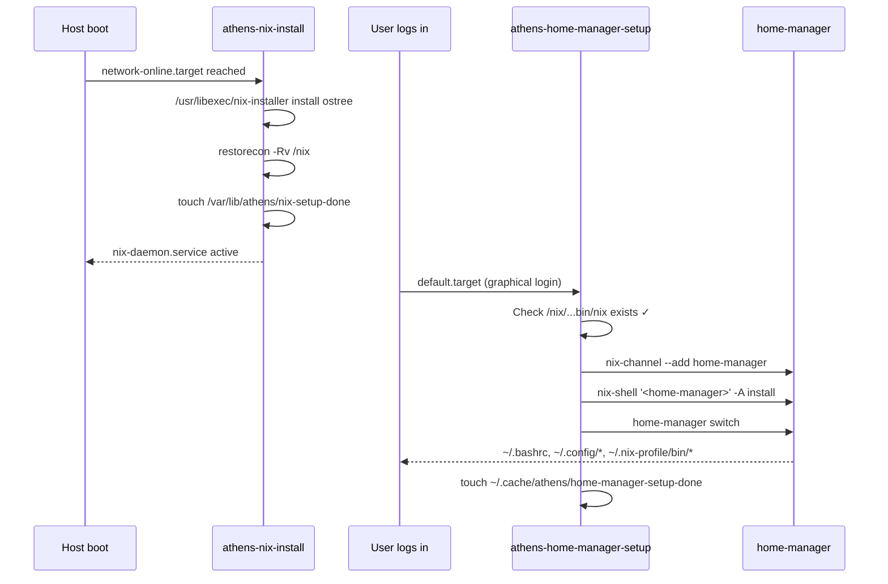

# nix-home Design

**Spec**: `.specs/features/nix-home/spec.md`
**Context**: `.specs/features/nix-home/context.md` (15 locked decisions)
**Status**: Draft

---

## Architecture Overview

athens-os becomes a **three-layer stack**. Each layer has distinct lifecycle, ownership, and atomicity
guarantees.

```mermaid
graph TD
    subgraph Build["Image build (CI / just build)"]
        B1[Containerfile RUN build.sh]
        B2[Fetch nix-installer<br>→ /usr/libexec/nix-installer]
        B3[COPY system_files/usr /usr<br/>→ ships unit files]
        B4[COPY home /etc/skel<br/>→ ships starter home.nix]
        B1 --> B2
        B2 --> B3
        B3 --> B4
    end

    subgraph FirstBoot["First boot (per-host, once)"]
        S1[athens-nix-install.service]
        S2[/usr/libexec/nix-installer install ostree<br/>--persistence /var/lib/nix]
        S3[restorecon -Rv /nix]
        S4[Marker:<br/>/var/lib/athens/nix-setup-done]
        S1 --> S2
        S2 --> S3
        S3 --> S4
    end

    subgraph FirstLogin["First login (per-user, once)"]
        U1[athens-home-manager-setup.service]
        U2[nix-channel --add<br/>home-manager release-24.11]
        U3[nix-shell '<home-manager>' -A install]
        U4[home-manager switch]
        U5[Marker:<br/>~/.cache/athens/home-manager-setup-done]
        U1 --> U2
        U2 --> U3
        U3 --> U4
        U4 --> U5
    end

    subgraph Steady["Steady state"]
        R1[~/.nix-profile/bin/*<br/>mise, starship, atuin,<br/>zoxide, fzf, bat, eza, rg,<br/>nix-index, gh]
        R2[~/.bashrc, ~/.config/*<br/>managed by home-manager]
        R3[/nix bind-mounted<br/>from /var/lib/nix]
    end

    Build --> FirstBoot
    FirstBoot --> FirstLogin
    FirstLogin --> Steady
```

**Atomicity contract per layer**:

| Layer | Owner | Atomicity | Rollback |
|---|---|---|---|
| RPM image (system) | `rpm-ostree` | Full image | `rpm-ostree rollback` |
| Nix store (`/nix`) | `nix-daemon` (system scope) | Per-derivation | `nix-env --rollback` (global) |
| Home-manager (`$HOME`) | `home-manager` (per-user) | Per-generation | `home-manager generations` + `switch <gen>` |

The system layer never touches `/nix`. Nix never touches `/etc` or `/usr`. Home-manager never touches
anything outside `$HOME` and `/nix/var/nix/profiles/per-user/$USER`. Clean separation = clean rollback.

---

## Code Reuse Analysis

### Existing Patterns to Leverage

| Pattern | Source | Applied to |
|---|---|---|
| System oneshot + sentinel marker + idempotent retry | `system_files/etc/systemd/system/athens-flatpak-install.service` | `athens-nix-install.service` |
| User oneshot + per-user marker + `default.target.wants/` symlink | `system_files/usr/lib/systemd/user/athens-vscode-setup.service` | `athens-home-manager-setup.service` |
| `ConditionPathExists=!<marker>` guard for idempotency | Both services above | Both new services |
| Inline `bash -c '...'` ExecStart | Both services above | Both new services |
| Persistent COPR / repo pattern | `build_files/build.sh` PERSISTENT_COPRS | N/A — we explicitly remove the mise repo equivalent |
| `COPY home /etc/skel` for user defaults | `Containerfile:34` | Replaces file set under `home/` with a single `home.nix` |

### Integration Points

| System | How nix-home integrates |
|---|---|
| `build.sh` | New curl+install block fetches `nix-installer` binary, stages at `/usr/libexec/` with 0755. Removes mise-repo registration if any. |
| `Containerfile` | Unchanged structure; new files flow through existing `COPY system_files/usr /usr` and `COPY home /etc/skel` stages. |
| `Justfile` | `capture-home` / `apply-home` / `diff-home` recipes replaced by `home-edit` / `home-apply` / `home-diff` wired to `home-manager` CLI. |
| `systemd` | Two new services: one system-scope (boot), one user-scope (login). Both use the same marker-file retry pattern as the existing two services. |
| `/etc/skel` | Reduced to a single file. Repo path `home/.config/home-manager/home.nix` → `/etc/skel/.config/home-manager/home.nix`. |

### Concerns

`.specs/codebase/CONCERNS.md` does not exist. No fragile-area mitigation required.

---

## Components

### 1. `build.sh` — fetch and stage `nix-installer`

- **Purpose**: Download the pinned upstream nix-installer binary at image build time and place it in
  the read-only image at `/usr/libexec/nix-installer` so first-boot service has no network dependency
  on the nix installer release itself.
- **Location**: `build_files/build.sh` (modify existing; add new block near top).
- **Interface** (shell contract):

  ```bash
  # Pinned version — single source of truth. Bump via PR.
  NIX_INSTALLER_VERSION="0.34.0"  # example; pin to current upstream release
  NIX_INSTALLER_URL="https://github.com/NixOS/experimental-nix-installer/releases/download/v${NIX_INSTALLER_VERSION}/nix-installer-x86_64-unknown-linux-gnu"

  curl -sSfL "$NIX_INSTALLER_URL" -o /usr/libexec/nix-installer
  chmod 0755 /usr/libexec/nix-installer
  ```

- **Dependencies**: `curl` (present in base image), network during CI build.
- **Reuses**: Logging `log()` helper; `set -euo pipefail` pattern.
- **Satisfies**: NXH-01, NXH-15 (inline env var pin).

### 2. `athens-nix-install.service` — first-boot system oneshot

- **Purpose**: On first boot of a freshly-rebased host, install nix with the `ostree` planner, persist
  `/nix` as a bind mount from `/var/lib/nix`, and relabel SELinux contexts. Idempotent: on failure,
  marker absent → retries next boot.
- **Location**: `system_files/etc/systemd/system/athens-nix-install.service` + symlink at
  `system_files/etc/systemd/system/multi-user.target.wants/athens-nix-install.service`.
- **Interfaces** (unit file):

  ```ini
  [Unit]
  Description=Install Nix with ostree persistence on first boot
  Documentation=https://github.com/NixOS/experimental-nix-installer
  Wants=network-online.target
  After=network-online.target ostree-remount.service
  ConditionPathExists=!/var/lib/athens/nix-setup-done

  [Service]
  Type=oneshot
  TimeoutStartSec=900
  ExecStart=/usr/libexec/nix-installer install ostree \
      --persistence /var/lib/nix \
      --no-confirm
  ExecStartPost=/usr/sbin/restorecon -Rv /nix
  ExecStartPost=/usr/bin/bash -c 'mkdir -p /var/lib/athens && touch /var/lib/athens/nix-setup-done'
  StandardOutput=journal
  StandardError=journal

  [Install]
  WantedBy=multi-user.target
  ```

- **Dependencies**: `/usr/libexec/nix-installer` (from component 1), network, `/var/lib/` writable.
- **Reuses**: Marker-file idempotency pattern and `WantedBy=multi-user.target` symlink layout from
  `athens-flatpak-install.service`.
- **Satisfies**: NXH-02, NXH-03, NXH-04, NXH-05, NXH-06, NXH-07.

### 3. `athens-home-manager-setup.service` — first-login user oneshot

- **Purpose**: On first login of each user, add the pinned home-manager channel, install the
  `home-manager` CLI, and run the first `home-manager switch` to materialize `$HOME` from the
  `/etc/skel`-seeded `~/.config/home-manager/home.nix`. Per-user idempotent.
- **Location**: `system_files/usr/lib/systemd/user/athens-home-manager-setup.service` + symlink at
  `system_files/usr/lib/systemd/user/default.target.wants/athens-home-manager-setup.service`.
- **Interfaces** (unit file):

  ```ini
  [Unit]
  Description=Bootstrap home-manager on first login
  Documentation=https://nix-community.github.io/home-manager/
  After=default.target
  ConditionPathExists=!%h/.cache/athens/home-manager-setup-done
  ConditionPathExists=/nix/var/nix/profiles/default/bin/nix

  [Service]
  Type=oneshot
  TimeoutStartSec=900
  Environment=HOME_MANAGER_CHANNEL=https://github.com/nix-community/home-manager/archive/release-24.11.tar.gz
  ExecStart=/usr/bin/bash -lc '\
      set -e; \
      mkdir -p %h/.cache/athens; \
      . /etc/profile.d/nix.sh 2>/dev/null || . /nix/var/nix/profiles/default/etc/profile.d/nix-daemon.sh; \
      nix-channel --add "$HOME_MANAGER_CHANNEL" home-manager; \
      nix-channel --update; \
      nix-shell "<home-manager>" -A install; \
      export PATH="$HOME/.nix-profile/bin:$PATH"; \
      home-manager switch; \
      touch %h/.cache/athens/home-manager-setup-done'
  StandardOutput=journal
  StandardError=journal

  [Install]
  WantedBy=default.target
  ```

- **Dependencies**: `athens-nix-install.service` must have completed on a prior boot (guarded by
  second `ConditionPathExists` pointing at a nix-installed file); network; `/etc/skel` seed must have
  provided `~/.config/home-manager/home.nix` at user creation.
- **Reuses**: Per-user marker + `WantedBy=default.target` symlink pattern from
  `athens-vscode-setup.service`. The existing `athens-mise-install.service` is removed entirely; this
  new unit is the conceptual replacement for the user-level slot.
- **Satisfies**: NXH-08, NXH-09, NXH-10, NXH-11.

### 4. Starter `home.nix` — the single source of truth

- **Purpose**: Declarative specification of the user environment. Evaluates under home-manager to
  produce `~/.bashrc`, `~/.config/git/config`, `~/.config/mise/config.toml`, `~/.config/starship.toml`,
  `~/.config/atuin/config.toml`, and a `~/.nix-profile` populated with declared packages.
- **Location**: `home/.config/home-manager/home.nix` in the repo → ships to
  `/etc/skel/.config/home-manager/home.nix` via existing `COPY home /etc/skel` in Containerfile.
- **Interface** (file content):

  ```nix
  { config, pkgs, ... }:
  {
    # ── Identity: resolved at switch time, so one file works for any user ──
    home.username      = builtins.getEnv "USER";
    home.homeDirectory = builtins.getEnv "HOME";
    home.stateVersion  = "24.11";

    # ── User-profile packages (ad-hoc CLI tooling & runtime manager) ──
    home.packages = with pkgs; [
      mise
    ];

    # ── Bash: the login/interactive shell ──
    programs.bash = {
      enable = true;
      initExtra = ''
        # mise activation (mise comes from home.packages above)
        if command -v mise >/dev/null 2>&1; then
          eval "$(mise activate bash)"
        fi
      '';
    };

    # ── Prompt ──
    programs.starship.enable = true;

    # ── Shell history (Ctrl+R fuzzy) ──
    programs.atuin.enable = true;

    # ── Git (name/email intentionally unset — user fills in) ──
    programs.git.enable = true;

    # ── CLI quality-of-life ──
    programs.zoxide.enable    = true;  # smart `cd`
    programs.fzf.enable       = true;  # Ctrl-R / Ctrl-T / Alt-C
    programs.bat.enable       = true;  # syntax-highlighted cat
    programs.eza = {                    # modern ls
      enable = true;
      icons  = true;
      git    = true;
    };
    programs.ripgrep.enable   = true;
    programs.nix-index.enable = true;  # which-package-provides lookup
    programs.gh.enable        = true;  # GitHub CLI

    # ── mise config, inlined as a managed dotfile ──
    home.file.".config/mise/config.toml".text = ''
      [tools]
      node        = "lts"
      bun         = "latest"
      pnpm        = "latest"
      python      = "latest"
      uv          = "latest"
      java        = "temurin-lts"
      kotlin      = "latest"
      gradle      = "latest"
      go          = "latest"
      rust        = "stable"
      zig         = "latest"
      android-sdk = "13.0"

      [settings]
      experimental                       = true
      trusted_config_paths               = ["/"]
      not_found_auto_install             = true
      idiomatic_version_file_enable_tools = ["node", "python", "java", "ruby", "go", "rust"]
      jobs                               = 8
      http_timeout                       = "60s"

      [settings.status]
      missing_tools = "if_other_versions_installed"
      show_env      = false
      show_tools    = false
    '';
  }
  ```

- **Dependencies**: nixpkgs (home-manager pulls this via the channel), home-manager modules.
- **Reuses**: The mise toolchain block is a straight port of the current `home/.config/mise/config.toml`
  minus `act`, `atuin`, and `direnv` entries (now either nix-managed or dropped per D-08, D-09, D-10).
- **Satisfies**: NXH-12 through NXH-19, NXH-34 through NXH-40.

### 5. `Justfile` — home-manager workflow recipes

- **Purpose**: Repo-local UX for editing `home.nix`, applying it to the live `$HOME`, and previewing
  generation diffs without memorizing `home-manager` flags.
- **Location**: `Justfile` (modify existing).
- **Interfaces** (new recipes):

  ```justfile
  # Edit the repo's home.nix in $EDITOR
  home-edit:
      ${EDITOR:-vi} home/.config/home-manager/home.nix

  # Apply the repo's home.nix to the live $HOME
  home-apply:
      home-manager switch -f home/.config/home-manager/home.nix

  # Preview what `home-apply` would change (against live activation)
  home-diff:
      home-manager build -f home/.config/home-manager/home.nix
      @echo "Built generation above; compare to current via: home-manager generations"
  ```

- **Removals**: `apply-home`, `capture-home`, `diff-home` (the rsync-based recipes from the current
  Justfile lines 45–55).
- **Dependencies**: `home-manager` CLI (installed by first-login unit for that user).
- **Reuses**: Just recipe conventions already in the file.
- **Satisfies**: NXH-29, NXH-30, NXH-31, NXH-32, NXH-33.

### 6. Removals (files the feature deletes)

| Path | Why |
|---|---|
| `home/.bashrc` | home-manager writes `~/.bashrc` from `programs.bash.initExtra` |
| `home/.config/mise/config.toml` | Inlined into `home.nix` via `home.file` |
| `system_files/usr/lib/systemd/user/athens-mise-install.service` | mise now via `home.packages` |
| `system_files/usr/lib/systemd/user/default.target.wants/athens-mise-install.service` | symlink orphan after unit removal |

- **Satisfies**: NXH-20, NXH-21, NXH-26.

---

## Data Models

### `home.nix` schema (domain model)

The starter `home.nix` is both a config file and the data model users will edit. Key fields:

| Field | Type | Purpose |
|---|---|---|
| `home.username` | string (from `builtins.getEnv "USER"`) | Who this generation is for |
| `home.homeDirectory` | path (from `builtins.getEnv "HOME"`) | Where activation symlinks land |
| `home.stateVersion` | string `"24.11"` | Schema compat marker — never bumped without reading release notes |
| `home.packages` | list of derivations | Packages placed in `~/.nix-profile/bin/` |
| `programs.<tool>.enable` | bool | Opt-in module: installs the tool + writes its rc file + wires shell activation |
| `home.file."path".text` | string | Arbitrary file contents written into `$HOME` |

### Marker files (state model)

| Marker | Scope | Meaning | Consumer |
|---|---|---|---|
| `/var/lib/athens/nix-setup-done` | system, per-host | nix installer ran successfully | `athens-nix-install.service` `ConditionPathExists!` guard |
| `~/.cache/athens/home-manager-setup-done` | user, per-user-per-host | home-manager bootstrap ran successfully | `athens-home-manager-setup.service` guard |
| `/var/lib/athens/flatpak-install-done` | system | (pre-existing, unchanged) | `athens-flatpak-install.service` |
| `~/.cache/athens/vscode-setup-done` | user | (pre-existing, unchanged) | `athens-vscode-setup.service` |

### Filesystem topology after first boot + first login

```
/nix/                                  → bind mount from /var/lib/nix (D-03)
/nix/var/nix/profiles/
    default → system-wide profile (nix-daemon managed)
    per-user/<user>/
        profile         → ad-hoc user installs (`nix profile install …`)
        home-manager    → home-manager generations
/var/lib/nix/                          → real storage; survives rpm-ostree upgrade
/var/lib/athens/nix-setup-done         → system marker
~/.nix-profile                         → symlink to per-user/<user>/home-manager
~/.config/home-manager/home.nix        → seeded from /etc/skel, user edits live
~/.cache/athens/home-manager-setup-done → user marker
~/.bashrc                              → symlink to /nix/store/...-bashrc
~/.config/{git,mise,atuin,starship.toml} → symlinks to /nix/store/...
```

---

## Service Ordering and Race Conditions

The feature introduces two new services; three ordering invariants must hold.

**Invariant 1: `athens-nix-install` runs only after `/var` is writable and network is up.**
- Enforced by `After=network-online.target ostree-remount.service`, `Wants=network-online.target`.

**Invariant 2: `athens-home-manager-setup` runs only after `/nix` exists and `nix` CLI works.**
- Enforced by `ConditionPathExists=/nix/var/nix/profiles/default/bin/nix` on the user unit.
- If the user logs in on the very boot where `athens-nix-install` is still running or failed, the
  condition is false → unit skipped this session → retries next login (marker never written).
- Eventual consistency: after nix install succeeds and user logs in once more, bootstrap runs.

**Invariant 3: `home-manager switch` runs only after channel install succeeds.**
- Enforced by `set -e` in the ExecStart shell block; any step failure aborts before the marker
  touches, so next login retries the whole sequence.



### Known race: user opens a terminal before `home-manager switch` finishes

- The shell sources Fedora's `/etc/bashrc` (no starship, no mise, no atuin).
- Duration: one shot, <1 minute on typical connection.
- Mitigation: none (acknowledged tradeoff per D-12). If feedback is bad, consider a tiny bootstrap
  `/etc/skel/.bashrc` that sources `hm-session-vars.sh` when present (tracked as open concern in
  context.md, not in this feature's scope).

---

## Error Handling Strategy

| Scenario | Detection | Handling | User Impact |
|---|---|---|---|
| Offline at first boot | nix-installer network failure → exit 1 | Marker not written → service re-runs next boot | None if user is offline anyway; transparent when online |
| SELinux `default_t` on `/nix` after large `nix profile install` | User discovers "permission denied" | Run `sudo restorecon -Rv /nix`; README documents it | One-time friction per install batch until upstream issue #1383 closes |
| `composefs` blocks `/nix` bind mount on silverblue-main:43 | `findmnt /nix` empty after install | README adds `rd.systemd.unit=root.transient` karg recipe; revisit in implementation | Possible manual karg add on existing hosts |
| home-manager channel unreachable at first login | `nix-channel --update` fails → `set -e` aborts | Marker absent → retry next login | One-shot delay; re-login fixes it |
| home-manager `switch` fails (eval error in `home.nix`) | Non-zero exit from `home-manager switch` | Marker absent; previous generation remains active (none on first switch); log in user journal | User inspects `journalctl --user -u athens-home-manager-setup`; typically a syntax error they just edited in |
| User deletes `~/.cache/athens/home-manager-setup-done` | N/A (user action) | Next login re-runs the whole bootstrap; home-manager is idempotent, so this is safe recovery | Safe "redo everything" escape hatch |
| Unit succeeds but `~/.bashrc` not written | `cat ~/.bashrc` absent | Manual rescue: `home-manager switch` from terminal | Rare; implies home-manager module misconfig |
| `rpm-ostree upgrade` replaces `/usr/libexec/nix-installer` with a newer pinned version | N/A (by design) | New installer only runs on hosts that haven't completed first-boot install (marker guards). Existing hosts ignore the bump. | None — Nix upgrades go through `nix upgrade-nix`, not the installer. |

### What we explicitly do NOT handle

- **Cosign-signed installer verification** — we trust the pinned GitHub release URL + TLS. The
  attack surface is bump-PR review. If this changes, add a `sha256sum -c` step to `build.sh`.
- **Per-user quota on `/nix`** — `/nix` is shared. If one user fills `/var/lib/nix`, all users are
  affected. Out of scope; addressable via separate quota if it ever matters.
- **home-manager rollback UX** — `home-manager generations` + `switch <gen>` is the upstream escape
  hatch; we don't wrap it.

---

## Tech Decisions (supplemental to context.md)

The 15 decisions in `context.md` (D-01 through D-15) are locked. New decisions specific to the
design phase:

| Decision | Choice | Rationale |
|---|---|---|
| nix-installer source integrity | TLS + pinned version URL; no sha256 pin (yet) | Keeps bump PRs one-line; reviewer verifies the release tag exists. Add sha256 if supply-chain concerns escalate. |
| User unit guard against "nix not ready" | Second `ConditionPathExists=/nix/var/nix/profiles/default/bin/nix` | Cheaper than a `Requires=` on a system unit from a user unit (systemd can't easily express that); lets the unit be re-tried silently. |
| `home-manager switch` `-f` pointing at repo path in Justfile | `-f home/.config/home-manager/home.nix` | Keeps repo copy as live-dev source; user's live `~/.config/home-manager/home.nix` only drives first-login bootstrap. |
| User shell between first login and switch completion | Fedora defaults, no bootstrap .bashrc | One file = one source of truth (D-12); mitigating shim complicates the mental model for a <1-minute edge case. |
| Unit `TimeoutStartSec` | 900s (15 min) for both new services | Network+channel update+switch can take minutes on slow links; generous timeout avoids spurious failures while still bounded. |
| nix profile activation in user unit | `. /nix/var/nix/profiles/default/etc/profile.d/nix-daemon.sh` | The experimental-nix-installer's standard profile script; works without shell rc files. Falls back to `/etc/profile.d/nix.sh` if present. |

---

## File Changes Summary

### Added

- `system_files/etc/systemd/system/athens-nix-install.service`
- `system_files/etc/systemd/system/multi-user.target.wants/athens-nix-install.service` (symlink → `../athens-nix-install.service`)
- `system_files/usr/lib/systemd/user/athens-home-manager-setup.service`
- `system_files/usr/lib/systemd/user/default.target.wants/athens-home-manager-setup.service` (symlink → `../athens-home-manager-setup.service`)
- `home/.config/home-manager/home.nix`

### Modified

- `build_files/build.sh` — add NIX_INSTALLER_VERSION pin + curl+install block + staging to `/usr/libexec/nix-installer`
- `Justfile` — remove `apply-home`/`capture-home`/`diff-home`; add `home-edit`/`home-apply`/`home-diff`
- `README.md` — document first-boot + first-login flow, SELinux restorecon note, composefs karg note (if applicable)

### Removed

- `home/.bashrc`
- `home/.config/mise/config.toml`
- `home/.config/mise/` (directory, if empty after config.toml removal)
- `system_files/usr/lib/systemd/user/athens-mise-install.service`
- `system_files/usr/lib/systemd/user/default.target.wants/athens-mise-install.service` (symlink)

### Unchanged (called out for clarity)

- `Containerfile` — the existing `COPY home /etc/skel` and `COPY system_files/usr /usr` already
  carry the new files through. No structural changes needed.
- `system_files/etc/systemd/system/athens-flatpak-install.service` — parallel flow, unchanged.
- `system_files/usr/lib/systemd/user/athens-vscode-setup.service` — parallel flow, unchanged.

---

## Open Implementation Concerns (carried from context.md)

These remain open through implementation; resolve as they come up in `/spec-run`:

1. **Composefs state on silverblue-main:43** — must verify by hand during the first local `just build`
   + rebase. If composefs is active and blocks the `/nix` bind mount, either document the karg workaround
   in README or disable composefs in the image. Tracked under NXH-04 / NXH-06 implementation.
2. **SELinux fix upstream** — [DeterminateSystems/nix-installer#1383](https://github.com/DeterminateSystems/nix-installer/issues/1383).
   If closed before we ship, drop `ExecStartPost=restorecon -Rv /nix`.
3. **home-manager channels deprecation signals** — watch home-manager release notes; if channels are
   formally deprecated in favor of flakes, revisit D-06.
4. **First-shell UX reality check** — revisit after dog-fooding. If the <1-minute gap feels worse
   than expected, add a minimal `/etc/skel/.bashrc` sourcing `hm-session-vars.sh` when present.
5. **`nix-installer` cosign/sha256 verification** — add if we ever see a compromised release PR or
   widen the trust surface.
