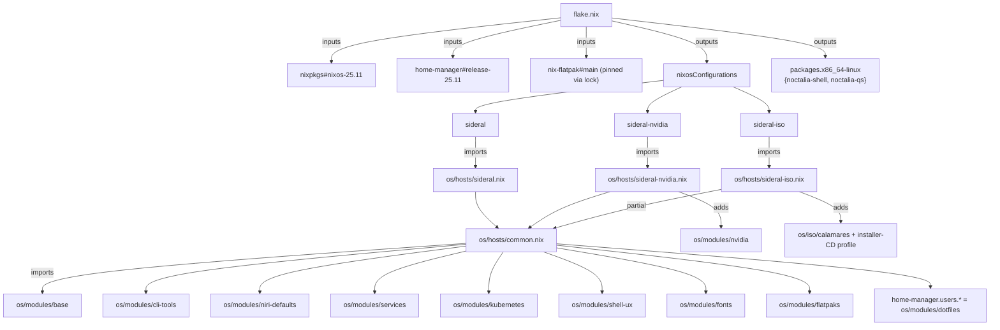
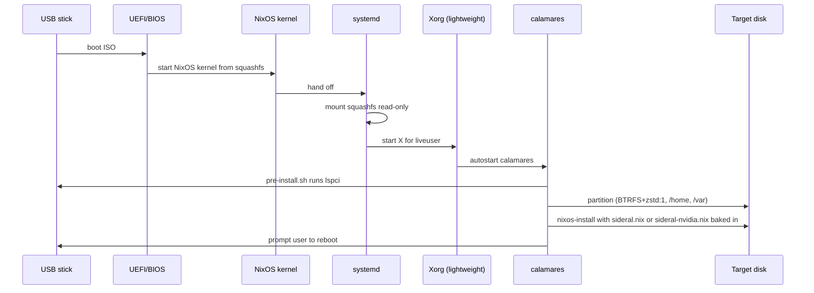

# nixos-port Design

> Status: **DESIGN — 2026-05-04.** Architectural plan for the `nixos` branch's 1:1 port. Spec at `spec.md`, decisions at `context.md`. Locks D-B through D-E (D-A and D-F remain deferred per memory). After this doc, `/spec-run nixos-port` breaks the work into tasks.

## Overview

The port is a **swap of OS plumbing**, not a re-architecting of sideral. The shape stays the same: one capability per directory under `os/modules/<capability>/`, each with a `src/` tree of byte-identical config files plus a thin orchestrator. What changes is the orchestrator's medium: instead of an RPM spec + dnf install pass + chezmoi seed materialised at first login, each module now has a single `default.nix` evaluated by `nixos-rebuild`. The `os/Containerfile` + `os/lib/*.sh` orchestrators retire because the nix evaluator subsumes their job.

Three architectural anchors:

1. **Flake at repo root, three `nixosConfigurations`.** `sideral` (open-source GPU), `sideral-nvidia` (proprietary), `sideral-iso` (installer-only). All three share the same module set under `os/modules/`; `sideral-nvidia` additionally imports `os/modules/nvidia/`; `sideral-iso` additionally imports an installer-CD profile + calamares.
2. **home-manager runs as a NixOS module.** A single `nixos-rebuild switch` materialises both system packages/services AND the user's `~/.config/...` files. No first-login bootstrap.
3. **Same file-paths land at the same locations, byte-identical.** `os/modules/niri-defaults/src/etc/xdg/niri/config.kdl` ends up at `/etc/xdg/niri/config.kdl` on the running system. `os/modules/dotfiles/src/usr/share/sideral/chezmoi/dot_config/niri/config.kdl` ends up at `~/.config/niri/config.kdl`. The `default.nix` files do the routing; the source trees are unchanged.

## Architecture

### Flake topology



### Activation contract

`nixos-rebuild switch --flake .#sideral` runs three logical phases the user never sees as separate steps:

| Phase | Replaces (Fedora flavor) | What it does |
|---|---|---|
| **eval** | `dnf install` resolution + `rpmbuild` spec eval | nix evaluator resolves the closure: every package, every `/etc` file, every systemd unit, every flatpak ref. |
| **build** | `Containerfile` Layer 2 + `rpm -Uvh sideral-*.rpm` | nix realises store paths; `system.build.toplevel` is the equivalent of "the OCI image". |
| **switch** | `rpm-ostree rebase` + reboot + chezmoi first-login apply | nix activation script swaps `/run/current-system`, runs `system.activationScripts`, runs `home-manager.activationPackage` for each managed user. No reboot needed for non-kernel changes. |

This is the central reason the port is simpler in shape: the three Fedora-flavor pipelines (RPM build, OCI bake, chezmoi runtime) collapse into one `nixos-rebuild` call.

## Target file tree

```
sideral/
├── flake.nix                                 (NEW)
├── flake.lock                                (NEW, pins inputs)
├── os/
│   ├── hosts/                                (NEW)
│   │   ├── common.nix                        (shared module list — imported by sideral.nix and sideral-nvidia.nix)
│   │   ├── sideral.nix                       (open-source GPU host)
│   │   ├── sideral-nvidia.nix                (NVIDIA host)
│   │   └── sideral-iso.nix                   (installer-only ISO host)
│   ├── pkgs/                                 (NEW; in-tree derivations for D-B fallback)
│   │   ├── noctalia-shell/default.nix
│   │   └── noctalia-qs/default.nix
│   ├── iso/                                  (NEW under os/; superseding repo-root iso/)
│   │   ├── calamares/
│   │   │   ├── branding/sideral/
│   │   │   │   ├── branding.desc
│   │   │   │   ├── sideral-logo.svg
│   │   │   │   ├── welcome.png
│   │   │   │   └── stylesheet.qss
│   │   │   ├── modules/
│   │   │   │   ├── partition.conf
│   │   │   │   ├── users.conf
│   │   │   │   ├── welcome.conf
│   │   │   │   └── finished.conf
│   │   │   └── settings.conf
│   │   └── pre-install.sh                    (lspci hook → writes sideral.nix or sideral-nvidia.nix)
│   └── modules/
│       ├── base/                             (rpm/ deleted; src/etc/os-release deleted; src/etc/yum.repos.d/ deleted)
│       │   ├── default.nix                   (NEW)
│       │   ├── UPGRADE.md                    (KEEP)
│       │   └── src/etc/containers/policy.json (KEEP byte-identical)
│       ├── cli-tools/                        (rpm/ deleted; src/etc/yum.repos.d/ deleted; *.sh deleted or ported into default.nix)
│       │   ├── default.nix                   (NEW; absorbs hide-chromium.sh + nushell-plugins-install.sh logic)
│       │   └── packages.txt                  (DELETE; superseded by systemPackages list in default.nix)
│       ├── niri-defaults/                    (rpm/ deleted; src/etc/yum.repos.d/ deleted)
│       │   ├── default.nix                   (NEW)
│       │   ├── README.md                     (KEEP, updated with NixOS notes)
│       │   └── src/                          (KEEP byte-identical)
│       │       ├── etc/kanata/sideral.kbd
│       │       ├── etc/profile.d/sideral-niri-ime.sh
│       │       ├── etc/sddm.conf.d/sideral.conf
│       │       ├── etc/xdg/niri/config.kdl
│       │       ├── etc/xdg/niri/config.d/sideral-nvidia.kdl
│       │       ├── etc/xdg/matugen/{config.toml,templates/*}
│       │       ├── usr/share/wayland-sessions/niri.desktop
│       │       ├── usr/share/wallpapers/sideral/default.jpg
│       │       └── usr/share/sddm/themes/silent/...      (full SilentSDDM tree)
│       ├── services/                         (rpm/ deleted)
│       │   ├── default.nix                   (NEW)
│       │   └── src/etc/distrobox/distrobox.conf (KEEP)
│       ├── kubernetes/                       (rpm/ deleted; src/etc/yum.repos.d/ deleted; src/etc/profile.d/sideral-kind-podman.sh deleted — env vars move to default.nix)
│       │   └── default.nix                   (NEW)
│       ├── shell-ux/                         (rpm/ deleted)
│       │   ├── default.nix                   (NEW; ships njust wrapper + sideral.just + sideral-motd.sh)
│       │   └── src/
│       │       ├── etc/sideral/sideral.just                  (RENAMED from src/usr/share/ublue-os/just/60-custom.just; three recipe bodies edited)
│       │       ├── etc/profile.d/sideral-motd.sh             (NEW; replaces ublue-os-just-shipped /etc/profile.d/user-motd.sh)
│       │       ├── etc/profile.d/sideral-shell-migrate.sh    (KEEP)
│       │       ├── etc/profile.d/sideral-nushell-plugins.sh  (KEEP)
│       │       ├── etc/zshrc                                 (KEEP)
│       │       ├── etc/user-motd                             (KEEP)
│       │       ├── etc/mise/config.toml                      (KEEP)
│       │       └── usr/lib/systemd/user/rclone-gdrive.service (KEEP)
│       ├── flatpaks/                         (install.sh deleted; src/etc/sideral-flatpak-* deleted; src/etc/systemd/* deleted; src/etc/flatpak-manifest deleted; live-iso.txt deleted; rpm/ deleted)
│       │   └── default.nix                   (NEW; embeds the 11-entry curated set as services.flatpak.packages)
│       ├── dotfiles/                         (rpm/ deleted; src/etc/profile.d/sideral-chezmoi-defaults.sh deleted — first-login mechanism retires)
│       │   ├── default.nix                   (NEW; home-manager module)
│       │   └── src/usr/share/sideral/chezmoi/ (KEEP byte-identical; HM reads from here)
│       ├── nvidia/                           (NEW dir; absorbs os/build/nvidia/)
│       │   ├── default.nix                   (NEW)
│       │   └── src/                          (MOVED from os/build/nvidia/, files unchanged)
│       │       ├── modprobe.d/sideral-nvidia.conf
│       │       ├── nvidia-app-profiles/50-niri.json
│       │       └── environment.d/90-sideral-niri-nvidia.conf
│       │       (kargs.d/00-nvidia.toml content is encoded as boot.kernelParams in default.nix, file deleted)
│       │       (niri.config.d/sideral-nvidia.kdl already lives in niri-defaults/src/etc/xdg/niri/config.d/, gated by lib.mkIf)
│       └── fonts/                            (NEW dir; absorbs os/build/fonts/)
│           └── default.nix                   (NEW; just sets fonts.packages)
├── iso/                                      (DELETE — anaconda-hook.sh + flatpaks.txt symlink retire)
├── os/Containerfile                          (DELETE)
├── os/lib/                                   (DELETE; build.sh + build-rpms.sh + install-packages.sh)
├── os/build/                                 (DELETE; collapsed into os/modules/{fonts,nvidia})
├── Justfile                                  (REWRITE; recipes target nixos-rebuild)
├── .github/workflows/build.yml               (REWRITE; flake-driven, no OCI matrix)
├── .releaserc.json + package.json + package-lock.json (KEEP; semantic-release pipeline unchanged)
└── .specs/features/nixos-port/               (already populated: spec.md, context.md, design.md)
```

**Diff invariant** (per Success Criteria, Spec line 248): `git diff main..nixos -- 'os/modules/*/src/*'` should be near-empty modulo the four deletions called out by C-15/C-16/C-17 and the three-recipe-body rewrite for `sideral.just`. If a `src/` file other than `os-release`, `yum.repos.d/*`, the flatpak-manifest set, the chezmoi first-login profile.d, or `60-custom.just`'s rename gets touched on this branch, that's a regression.

## Component breakdown

Each `default.nix` is described with **purpose**, **key NixOS options it sets**, and **dependencies**. Implementation lands in `/spec-run`.

### `flake.nix`

**Purpose**: Wire the inputs, expose the three `nixosConfigurations`, expose out-of-tree packages.

**Inputs** (locked at `nixos-25.11` per C-11):

```nix
{
  inputs = {
    nixpkgs.url = "github:NixOS/nixpkgs/nixos-25.11";
    home-manager = {
      url = "github:nix-community/home-manager/release-25.11";
      inputs.nixpkgs.follows = "nixpkgs";
    };
    nix-flatpak.url = "github:gmodena/nix-flatpak";   # pinned via flake.lock; bumped intentionally
  };
}
```

**Outputs**:

```nix
{
  nixosConfigurations = {
    sideral         = nixpkgs.lib.nixosSystem { system = "x86_64-linux"; modules = [ ./os/hosts/sideral.nix ]; specialArgs = { inherit inputs self; }; };
    sideral-nvidia  = nixpkgs.lib.nixosSystem { system = "x86_64-linux"; modules = [ ./os/hosts/sideral-nvidia.nix ]; specialArgs = { inherit inputs self; }; };
    sideral-iso     = nixpkgs.lib.nixosSystem { system = "x86_64-linux"; modules = [ ./os/hosts/sideral-iso.nix ]; specialArgs = { inherit inputs self; }; };
  };
  packages.x86_64-linux = {
    noctalia-shell = pkgs.callPackage ./os/pkgs/noctalia-shell {};
    noctalia-qs    = pkgs.callPackage ./os/pkgs/noctalia-qs {};
    sideral-iso    = self.nixosConfigurations.sideral-iso.config.system.build.isoImage;
  };
  formatter.x86_64-linux = nixpkgs.legacyPackages.x86_64-linux.alejandra;
}
```

**Why specialArgs include `inputs`**: nix-flatpak's NixOS module is imported as `inputs.nix-flatpak.nixosModules.nix-flatpak`, and the flake input has to reach the modules.

### `os/hosts/common.nix`

**Purpose**: The shared module-import list for `sideral` + `sideral-nvidia`. Single source of truth for "what's a sideral system."

```nix
{ inputs, ... }: {
  imports = [
    inputs.home-manager.nixosModules.home-manager
    inputs.nix-flatpak.nixosModules.nix-flatpak
    ../modules/base
    ../modules/cli-tools
    ../modules/niri-defaults
    ../modules/services
    ../modules/kubernetes
    ../modules/shell-ux
    ../modules/fonts
    ../modules/flatpaks
    ../modules/dotfiles  # imported here to register the home-manager.users.* attribute
  ];

  system.stateVersion = "25.11";
  nixpkgs.config.allowUnfree = true;  # for vscode + nvidia
}
```

### `os/hosts/sideral.nix`

```nix
{ ... }: {
  imports = [ ./common.nix ];
  networking.hostName = "sideral";
  system.nixos.variant_id = "open-source";
  # No nvidia module — open-source amdgpu/i915/xe/nouveau stack from kernel.
}
```

### `os/hosts/sideral-nvidia.nix`

```nix
{ ... }: {
  imports = [ ./common.nix ../modules/nvidia ];
  networking.hostName = "sideral";
  system.nixos.variant_id = "nvidia";
  hardware.nvidia.enable = true;  # the gate referenced by os/modules/nvidia/default.nix
}
```

### `os/hosts/sideral-iso.nix`

```nix
{ modulesPath, pkgs, ... }: {
  imports = [
    "${modulesPath}/installer/cd-dvd/iso-image.nix"
    ../modules/base   # /etc/os-release identity ("sideral", variant_id="iso")
    # NOTE: no niri-defaults / cli-tools / shell-ux / dotfiles / flatpaks here —
    # this is an installer-only ISO (C-10). Ship calamares + the minimum to render it.
  ];

  isoImage = {
    isoName  = "sideral_x86_64.iso";
    volumeID = "SIDERAL_INSTALL";
    makeEfiBootable    = true;
    makeUsbBootable    = true;
    squashfsCompression = "zstd -Xcompression-level 19";
  };

  services.xserver.enable = true;       # calamares is Qt — needs an X session under the live env
  services.xserver.displayManager.lightdm.enable = false;  # no greeter, no SDDM
  services.xserver.displayManager.startx.enable = true;    # autostart calamares as the only client
  # autorun calamares as the X session for the liveuser
  systemd.services."calamares-autostart" = { ... };

  # calamares + branding
  environment.systemPackages = with pkgs; [ calamares ];
  environment.etc = {
    "calamares/branding/sideral/branding.desc".source = ../iso/calamares/branding/sideral/branding.desc;
    "calamares/branding/sideral/sideral-logo.svg".source = ../iso/calamares/branding/sideral/sideral-logo.svg;
    "calamares/branding/sideral/welcome.png".source = ../iso/calamares/branding/sideral/welcome.png;
    "calamares/branding/sideral/stylesheet.qss".source = ../iso/calamares/branding/sideral/stylesheet.qss;
    "calamares/settings.conf".source = ../iso/calamares/settings.conf;
    "calamares/modules/partition.conf".source = ../iso/calamares/modules/partition.conf;
    "calamares/modules/users.conf".source     = ../iso/calamares/modules/users.conf;
    "calamares/modules/welcome.conf".source   = ../iso/calamares/modules/welcome.conf;
    "calamares/modules/finished.conf".source  = ../iso/calamares/modules/finished.conf;
    "sideral/iso/pre-install.sh" = { source = ../iso/pre-install.sh; mode = "0755"; };
  };

  users.users.liveuser = {
    isNormalUser = true;
    extraGroups  = [ "wheel" ];
    password     = "";
    shell        = pkgs.zsh;
  };
  security.sudo.wheelNeedsPassword = false;

  # The flake repo gets baked into the ISO at /etc/sideral/flake so the
  # pre-install hook can `imports = [ ./sideral.nix ]` from the target's /etc/nixos/.
  environment.etc."sideral/flake".source = self;
}
```

**Boot path** (per NXP-05): kernel → initrd → systemd → minimal X under `liveuser` → calamares window. No SDDM, no niri, no Noctalia. The first time those render is **post-install on the target system**.

### `os/modules/base/default.nix`

**Purpose**: System identity (os-release writer config) + container trust policy + UPGRADE.md.

```nix
{ pkgs, ... }: {
  system.nixos = {
    distroId   = "sideral";
    distroName = "sideral";
    # variant_id is set by the host (sideral / nvidia / iso)
  };
  # Container trust policy — file-byte-identical to Fedora flavor.
  environment.etc."containers/policy.json".source = ./src/etc/containers/policy.json;
}
```

**Files materialised**:
- `/etc/os-release` (auto-written by NixOS, with `ID=sideral`, `NAME=sideral`, `VERSION_ID=<nixos-version>`, `VARIANT_ID=<host>`)
- `/etc/containers/policy.json`

### `os/modules/cli-tools/default.nix`

**Purpose**: Every CLI binary in the Fedora `cli-tools` packages.txt, plus the chromium hide + nushell plugins side-effects.

```nix
{ pkgs, ... }: {
  environment.systemPackages = with pkgs; [
    chezmoi mise atuin fzf bat eza ripgrep zoxide gh git-lfs
    gcc gnumake cmake helix zsh zsh-syntax-highlighting zsh-autosuggestions
    rclone fuse3 chromium nushell carapace vscode starship
    just  # for the njust wrapper (NXP-49)
  ];

  # Chromium hide (NXP-10 → ports the hide-chromium.sh logic).
  # Drop a /etc/xdg/autostart override + a desktop-entry override.
  environment.etc."xdg/applications/chromium-browser.desktop".text = ''
    [Desktop Entry]
    NoDisplay=true
    Name=Chromium (hidden)
    Exec=chromium %U
    Type=Application
  '';

  # Nushell plugins: nixpkgs ships nushellPlugins.{formats,gstat,query} as
  # separate derivations — no cargo build required. Wire them at /etc/nushell/plugins/
  # so they're visible system-wide. (Replaces nushell-plugins-install.sh's runtime cargo build.)
  environment.etc."nushell/plugins/nu_plugin_query".source   = "${pkgs.nushellPlugins.query}/bin/nu_plugin_query";
  environment.etc."nushell/plugins/nu_plugin_formats".source = "${pkgs.nushellPlugins.formats}/bin/nu_plugin_formats";
  environment.etc."nushell/plugins/nu_plugin_gstat".source   = "${pkgs.nushellPlugins.gstat}/bin/nu_plugin_gstat";
  # nu_plugin_file / nu_plugin_rpm / nu_plugin_explore: nixpkgs may not ship them.
  # Defer to /spec-run task — pkgs.nushellPlugins.<x> if available, otherwise drop.
}
```

**Notes on translation**:
- The Fedora `nushell-plugins-install.sh` script that built rust plugins inline is replaced by **nixpkgs-bundled derivations** where available. Plugins that nixpkgs doesn't ship (file, rpm, explore) drop to a `/spec-run` task that decides per-plugin: in-tree derivation in `os/pkgs/`, or accept the gap.
- Fedora's chromium-hide patches `/usr/share/applications/chromium*.desktop` in-place. NixOS makes that file read-only (it's a store path), so we ship a higher-priority `xdg/applications/chromium-browser.desktop` override instead. Same end-user behavior.

### `os/modules/niri-defaults/default.nix`

**Purpose**: Heaviest module. Niri compositor + SDDM + SilentSDDM theme + matugen + ghostty + kanata + dependent CLI tools.

```nix
{ pkgs, lib, config, ... }: let
  noctalia-shell = pkgs.callPackage ../../pkgs/noctalia-shell {};
  noctalia-qs    = pkgs.callPackage ../../pkgs/noctalia-qs {};
in {
  # Packages — covers the niri-defaults packages.txt (Fedora + Terra split).
  environment.systemPackages = with pkgs; [
    niri kanshi wdisplays ddcutil brightnessctl fastfetch wlsunset
    fprintd fcitx5 fcitx5-configtool grim slurp wl-clipboard cliphist
    matugen ghostty kanata
    noctalia-shell noctalia-qs
  ];

  # Niri program module if available; otherwise expose the binary + the wayland-session manually.
  programs.niri.enable = lib.mkIf (lib.hasAttr "niri" pkgs.lib) true;

  # SDDM with SilentSDDM theme.
  services.displayManager.sddm = {
    enable = true;
    wayland.enable = true;
    theme = "silent";
    extraPackages = [ pkgs.kdePackages.qtsvg pkgs.kdePackages.qtmultimedia ];
  };
  # Theme files — point to /run/current-system/sw/share/sddm/themes/silent/
  environment.pathsToLink = [ "/share/sddm/themes" ];
  environment.etc."sddm.conf.d/sideral.conf".source = ./src/etc/sddm.conf.d/sideral.conf;

  # Kanata service (D-E lock — services.kanata is the idiomatic path; handles uinput perms + udev).
  services.kanata = {
    enable = true;
    keyboards.sideral = {
      configFile = ./src/etc/kanata/sideral.kbd;
    };
  };

  # IME env vars (replaces /etc/profile.d/sideral-niri-ime.sh).
  environment.sessionVariables = {
    XMODIFIERS    = "@im=fcitx";
    GTK_IM_MODULE = "fcitx";
    QT_IM_MODULE  = "fcitx";
    SDL_IM_MODULE = "fcitx";
  };
  # Keep the profile.d script ALSO byte-identical for legacy consumers (login from VT etc.).
  environment.etc."profile.d/sideral-niri-ime.sh".source = ./src/etc/profile.d/sideral-niri-ime.sh;

  # XDG configs — niri config + matugen config + templates.
  environment.etc."xdg/niri/config.kdl".source = ./src/etc/xdg/niri/config.kdl;
  environment.etc."xdg/matugen/config.toml".source = ./src/etc/xdg/matugen/config.toml;
  environment.etc."xdg/matugen/templates/ghostty".source     = ./src/etc/xdg/matugen/templates/ghostty;
  environment.etc."xdg/matugen/templates/helix.toml".source  = ./src/etc/xdg/matugen/templates/helix.toml;

  # NVIDIA niri drop-in — only when nvidia module is active (NXP-25).
  environment.etc."xdg/niri/config.d/sideral-nvidia.kdl" = lib.mkIf (config.hardware.nvidia.enable or false) {
    source = ./src/etc/xdg/niri/config.d/sideral-nvidia.kdl;
  };

  # Wayland-session entry, default wallpaper, SDDM theme tree.
  environment.etc."xdg/wayland-sessions/niri.desktop".source = ./src/usr/share/wayland-sessions/niri.desktop;
  environment.pathsToLink = [ "/share/wallpapers" "/share/sddm" ];
  # SDDM-theme tree handled via a derivation that wraps ./src/usr/share/sddm/themes/silent
  # and gets added to environment.systemPackages so it lands in $XDG_DATA_DIRS.
}
```

**Critical translation point — SDDM theme path**: Fedora ships SilentSDDM at `/usr/share/sddm/themes/silent/`. NixOS mounts the system closure at `/run/current-system/sw/share/...`. SDDM searches `$XDG_DATA_DIRS/sddm/themes/`, which includes `/run/current-system/sw/share/sddm/themes/`, so `Current = silent` resolves correctly *if* the theme tree is registered as part of the closure. We do that by wrapping the directory tree as a derivation:

```nix
let
  silentSddmTheme = pkgs.runCommand "sddm-theme-silent" { } ''
    mkdir -p $out/share/sddm/themes
    cp -r ${./src/usr/share/sddm/themes/silent} $out/share/sddm/themes/silent
  '';
in {
  environment.systemPackages = [ silentSddmTheme /* ... */ ];
}
```

### `os/modules/services/default.nix`

```nix
{ pkgs, ... }: {
  virtualisation.podman = {
    enable = true;
    dockerCompat = true;                          # podman-docker shim equivalent
    defaultNetwork.settings.dns_enabled = true;
  };
  environment.systemPackages = with pkgs; [ podman-compose ];

  services.flatpak.enable = true;                  # nix-flatpak (NXP-12, C-17)

  environment.etc."distrobox/distrobox.conf".source = ./src/etc/distrobox/distrobox.conf;
}
```

**Note on rclone-gdrive user unit**: ships from `shell-ux/default.nix` via `systemd.user.services.rclone-gdrive` — same content as `src/usr/lib/systemd/user/rclone-gdrive.service` but expressed in Nix so its dependencies (rclone binary path) substitute correctly.

### `os/modules/kubernetes/default.nix`

```nix
{ pkgs, ... }: {
  environment.systemPackages = with pkgs; [ kubectl kind helm ];
  environment.sessionVariables = {
    KIND_EXPERIMENTAL_PROVIDER = "podman";
    MINIKUBE_DRIVER            = "podman";
  };
  # /etc/profile.d/sideral-kind-podman.sh DELETES — env vars above subsume it.
}
```

### `os/modules/shell-ux/default.nix`

**Purpose**: System-wide shell wiring + the `njust` wrapper (NXP-49 / C-14) + `/etc/sideral/sideral.just` recipes file + `/etc/user-motd` printer.

```nix
{ pkgs, ... }: let
  njust = pkgs.writeShellScriptBin "njust" ''
    exec ${pkgs.just}/bin/just --justfile /etc/sideral/sideral.just "$@"
  '';
in {
  environment.systemPackages = [ njust pkgs.just ];

  programs.zsh.enable = true;
  users.defaultUserShell = pkgs.zsh;

  # /etc files — every byte-identical port from src/.
  environment.etc = {
    "zshrc".source                                       = ./src/etc/zshrc;
    "user-motd".source                                   = ./src/etc/user-motd;
    "mise/config.toml".source                            = ./src/etc/mise/config.toml;
    "profile.d/sideral-shell-migrate.sh".source          = ./src/etc/profile.d/sideral-shell-migrate.sh;
    "profile.d/sideral-nushell-plugins.sh".source        = ./src/etc/profile.d/sideral-nushell-plugins.sh;
    "profile.d/sideral-motd.sh".source                   = ./src/etc/profile.d/sideral-motd.sh;
    "sideral/sideral.just".source                        = ./src/etc/sideral/sideral.just;
  };

  # rclone-gdrive systemd user unit (Nix-native definition; references rclone from store).
  systemd.user.services.rclone-gdrive = {
    description = "rclone Google Drive auto-mount at ~/gdrive";
    after = [ "network-online.target" ];
    wants = [ "network-online.target" ];
    wantedBy = [ "default.target" ];
    serviceConfig = {
      Type = "notify";
      ExecStart = "${pkgs.rclone}/bin/rclone mount gdrive: %h/gdrive --vfs-cache-mode full";
      ExecStop  = "${pkgs.fuse3}/bin/fusermount -u %h/gdrive";
      Restart   = "on-failure";
      RestartSec = "5s";
    };
  };
}
```

**Critical**: the recipes file `src/etc/sideral/sideral.just` is the **renamed** `60-custom.just` per C-14, with three body edits:
- `update`  — body now `sudo nixos-rebuild switch --upgrade --flake github:athenabriana/sideral#$(. /etc/os-release; echo "$VARIANT_ID")`. (D-C lock: raw `nixos-rebuild`, not `nh`.)
- `apply-defaults` — body now `echo "Defaults are applied at activation; run \`sudo nixos-rebuild switch --flake .#sideral\` to refresh."`.
- `chezmoi` cheatsheet — body unchanged but the example recipe text drops references to `/usr/share/sideral/chezmoi/` first-login auto-apply (no longer how it works).

### `os/modules/flatpaks/default.nix`

**Purpose**: Declarative flatpak set via nix-flatpak (C-17, NXP-52).

```nix
{ ... }: {
  services.flatpak.packages = [
    "app.zen_browser.zen"
    "io.github.kolunmi.Bazaar"
    "com.github.tchx84.Flatseal"
    "com.mattjakeman.ExtensionManager"
    "io.podman_desktop.PodmanDesktop"
    "com.ranfdev.DistroShelf"
    "net.nokyan.Resources"
    "it.mijorus.smile"
    "org.pvermeer.WebAppHub"
    "org.gnome.World.PikaBackup"
    "re.sonny.Junction"
  ];
  services.flatpak.remotes = [
    { name = "flathub"; location = "https://flathub.org/repo/flathub.flatpakrepo"; }
  ];
}
```

**Reconciliation contract**: nix-flatpak materialises the list as a oneshot at activation. Drop a ref → it uninstalls on next switch. This replaces the Fedora-flavor `sideral-flatpak-purge` self-heal-on-every-boot mechanism.

### `os/modules/dotfiles/default.nix`

**Purpose**: home-manager module. **This is imported into `home-manager.users.<user>` from `common.nix`**, not into the system module list directly.

```nix
{ config, lib, pkgs, ... }: let
  src = ./src/usr/share/sideral/chezmoi;
in {
  home.stateVersion = "25.11";

  # XDG configs — every chezmoi dot_config/ entry lands at ~/.config/.
  xdg.configFile = {
    "niri/config.kdl".source             = "${src}/dot_config/niri/config.kdl";
    "niri/noctalia.kdl".source           = "${src}/dot_config/niri/noctalia.kdl";
    "matugen/config.toml".source         = "${src}/dot_config/matugen/config.toml";
    "mise/config.toml".source            = "${src}/dot_config/mise/config.toml";
    "ghostty/config".source              = "${src}/dot_config/ghostty/config";
    "nushell/env.nu".source              = "${src}/dot_config/nushell/env.nu";
    "nushell/config.nu".source           = "${src}/dot_config/nushell/config.nu";
    "noctalia/settings.json".source      = "${src}/dot_config/noctalia/settings.json";
  };

  # Top-level dotfiles.
  home.file = {
    ".bashrc".source = "${src}/dot_bashrc";
    ".zshrc".source  = "${src}/dot_zshrc";
  };

  # Programs that home-manager wires for us — every one we already wanted via /etc/profile.d/.
  programs.starship.enable = true;
  programs.atuin.enable    = true;
  programs.zoxide.enable   = true;
  programs.fzf.enable      = true;
  programs.bat.enable      = true;
  programs.eza.enable      = true;
  programs.git.enable      = true;
  programs.gh.enable       = true;
  programs.nushell.enable  = true;
  programs.helix.enable    = true;

  # Activation: install nu prompts (replaces run_onchange_after_install-nu-prompts.sh).
  home.activation.installNuPrompts = lib.hm.dag.entryAfter [ "writeBoundary" ] ''
    bash ${src}/run_onchange_after_install-nu-prompts.sh
  '';
}
```

### `os/modules/nvidia/default.nix`

**Purpose**: gated NVIDIA stack — only active when `config.hardware.nvidia.enable == true`.

```nix
{ config, lib, pkgs, ... }: lib.mkIf (config.hardware.nvidia.enable or false) {
  services.xserver.videoDrivers = [ "nvidia" ];
  hardware.nvidia = {
    modesetting.enable = true;
    open = false;                      # proprietary (parity with Fedora flavor)
    powerManagement.enable = true;
    nvidiaSettings = true;
  };
  hardware.graphics = {
    enable = true;
    extraPackages = with pkgs; [ libva-vdpau-driver libva libvdpau-va-gl ];
  };
  environment.systemPackages = with pkgs; [ libva-utils ];

  # kargs (NXP-23): translation of os/build/nvidia/kargs.d/00-nvidia.toml.
  boot.kernelParams = [
    "nvidia-drm.modeset=1"
    "nvidia-drm.fbdev=1"
    "rd.driver.blacklist=nouveau"
    "modprobe.blacklist=nouveau"
  ];
  boot.blacklistedKernelModules = [ "nouveau" ];

  # modprobe NVreg options (NXP-24): file-byte-identical, just delivered as raw text.
  boot.extraModprobeConfig = builtins.readFile ./src/modprobe.d/sideral-nvidia.conf;

  # Wayland env vars (NXP-26).
  environment.sessionVariables = {
    LIBVA_DRIVER_NAME      = "nvidia";
    NVD_BACKEND            = "direct";
    MOZ_DISABLE_RDD_SANDBOX = "1";
    GBM_BACKEND            = "nvidia-drm";
    __GLX_VENDOR_LIBRARY_NAME = "nvidia";
  };

  # nvidia-app-profiles (NXP-27).
  environment.etc."nvidia/nvidia-application-profiles-rc.d/50-niri.json".source =
    ./src/nvidia-app-profiles/50-niri.json;
}
```

**Note**: the niri-config drop-in `sideral-nvidia.kdl` lives in `niri-defaults/src/etc/xdg/niri/config.d/`, gated by `lib.mkIf config.hardware.nvidia.enable` from `niri-defaults/default.nix`. Single home for the file, conditional installation.

### `os/modules/fonts/default.nix`

```nix
{ pkgs, ... }: {
  fonts.packages = with pkgs; [
    cascadia-code jetbrains-mono adwaita-fonts open-dyslexic
    source-serif source-sans
  ];
  fonts.fontconfig.enable = true;
}
```

### `os/pkgs/noctalia-shell/default.nix` and `os/pkgs/noctalia-qs/default.nix`

**Purpose** (D-B lock): in-tree derivations that fetch the same upstream tarballs Terra builds RPMs from. This is the safe fallback — if `pkgs.noctalia-shell` exists in `nixos-25.11`, `/spec-run` swaps to it and deletes these.

**Sketch**:

```nix
# os/pkgs/noctalia-shell/default.nix
{ stdenv, fetchFromGitHub, qt6, kdePackages, ... }: stdenv.mkDerivation rec {
  pname = "noctalia-shell";
  version = "4.7.6";  # parity with Terra pin (niri-defaults README.md)
  src = fetchFromGitHub {
    owner = "noctalia-dev";
    repo  = "noctalia-shell";
    rev   = "v${version}";
    hash  = "sha256-0000000000000000000000000000000000000000000=";  # filled at /spec-run
  };
  nativeBuildInputs = [ qt6.qmake ];
  buildInputs = [ qt6.qtbase qt6.qtdeclarative kdePackages.qtsvg ];
  # ...
}
```

`/spec-run` task: fill the hash, verify the build, decide whether to keep this in-tree or substitute from nixpkgs.

## ISO + calamares architecture

### Boot sequence (NXP-05, C-10)



### Pre-install hook (`os/iso/pre-install.sh`)

The functional equivalent of Fedora's `iso/anaconda-hook.sh` — but instead of writing a kickstart fragment, it writes a `/etc/nixos/configuration.nix` on the target disk:

```bash
#!/usr/bin/env bash
set -euo pipefail
TARGET_ROOT="${1:-/mnt}"

if lspci 2>/dev/null | grep -qiE 'vga.*nvidia|3d.*nvidia|display.*nvidia'; then
    HOST="sideral-nvidia"
else
    HOST="sideral"
fi

# Copy the flake repo onto the target.
cp -a /etc/sideral/flake "$TARGET_ROOT/etc/nixos/sideral"

cat > "$TARGET_ROOT/etc/nixos/configuration.nix" <<EOF
{
  imports = [ ./sideral/os/hosts/${HOST}.nix ./hardware-configuration.nix ];
  system.stateVersion = "25.11";
  users.users.\${1:-user} = {
    isNormalUser = true;
    extraGroups  = [ "wheel" "networkmanager" "video" ];
    initialPassword = "changeme";
  };
}
EOF
```

Calamares wires this hook into the `bootloader` / `users` module sequence so it runs **after** partition + format and **before** `nixos-install`.

### Calamares branding (NXP-06)

`os/iso/calamares/branding/sideral/branding.desc` is the standard calamares branding manifest; key fields:

```yaml
componentName:  sideral
welcomeStyleCalamares: true
images:
    productLogo:    sideral-logo.svg
    productIcon:    sideral-logo.svg
    productWelcome: welcome.png
slideshow: []
style:
    sidebarBackground: "#1f1f28"   # noctalia-aligned dark
    sidebarText:       "#dcd7ba"
    sidebarTextHighlight: "#7e9cd8"
strings:
    productName:     sideral
    shortProductName: sideral
    version:         25.11
    shortVersionedName: sideral 25.11
    bootloaderEntryName: sideral
```

`stylesheet.qss` provides the Qt widget overrides (button colors, frame, font) — kept under 80 lines, "light brand" per C-10.

### Calamares modules (NXP-06 sequence)

`settings.conf` enables the wizard sequence:
```yaml
sequence:
  - show:    [ welcome, locale, keyboard, partition, users, summary ]
  - exec:    [ partition, mount, unpackfs, machineid, fstab, locale, keyboard, localecfg, users, hwclock, services-systemd, bootloader-config, grubcfg, bootloader, packages, initramfs, removeuser, finished ]
  - show:    [ finished ]
```
With `pre-install.sh` wired between `mount` and `unpackfs` via the calamares `shellprocess` module.

## CI architecture

### Workflow rewrite (NXP-29 .. NXP-34)

```yaml
name: build-sideral

on:
  push:
    branches: [main, nixos]
  pull_request:
    branches: [main, nixos]
  workflow_dispatch: {}
  schedule: [{ cron: "5 10 * * *" }]

jobs:
  build:
    name: Build closure (${{ matrix.variant }})
    runs-on: ubuntu-24.04
    strategy:
      fail-fast: false
      matrix:
        include:
          - variant: sideral
          - variant: sideral-nvidia
    steps:
      - uses: actions/checkout@v4
      - uses: ublue-os/remove-unwanted-software@v9   # carries over from Fedora workflow
      - uses: cachix/install-nix-action@v27
        with:
          nix_path: nixpkgs=channel:nixos-25.11
          extra_nix_config: |
            experimental-features = nix-command flakes
            accept-flake-config = true
      - uses: DeterminateSystems/magic-nix-cache-action@v9
      - run: nix flake check
      - run: nix build .#nixosConfigurations.${{ matrix.variant }}.config.system.build.toplevel

  release:
    name: Build ISO + publish release
    needs: build
    if: github.ref == 'refs/heads/nixos' && (github.event_name == 'push' || github.event_name == 'workflow_dispatch')
    runs-on: ubuntu-24.04
    steps:
      - uses: actions/checkout@v4
        with: { fetch-depth: 0, persist-credentials: false }
      - uses: cachix/install-nix-action@v27
      - uses: DeterminateSystems/magic-nix-cache-action@v9
      - uses: actions/setup-node@v4
        with: { node-version: '22', cache: 'npm' }
      - run: npm ci || npm install --no-audit --no-fund
      - id: dryrun
        # ... same dry-run logic as Fedora workflow ...
      - if: steps.dryrun.outputs.skip == 'false'
        run: nix build .#sideral-iso
      - if: steps.dryrun.outputs.skip == 'false'
        run: |
          mkdir -p output
          cp -L result/iso/sideral_x86_64.iso output/sideral_x86_64.iso
          (cd output && sha256sum sideral_x86_64.iso > sideral_x86_64.iso.sha256)
      # ... R2 upload + semantic-release + release-notes append: identical to Fedora workflow ...
```

**Removed steps**: docker/setup-buildx-action, docker/login-action (ghcr.io), docker/metadata-action, docker/build-push-action, sigstore/cosign-installer, the cosign sign step, the titanoboa step.

**Kept steps**: maximise-disk-space, semantic-release dry-run, R2 AWS-CLI upload (env vars unchanged: `R2_ENDPOINT`, `R2_BUCKET`, `R2_PUBLIC_BASE`, `ISO_KEY`), release-notes append.

### Cache strategy (NXP-33)

`magic-nix-cache-action` provides per-PR/per-branch GHA-cache-backed nix substitution for free. No external Cachix account, no signing key. If first-rebuild times become a real complaint, the v2 follow-on adds Cachix without spec changes.

## Justfile rewrite

```just
default:
    @just --list --unsorted

# nix flake check + alejandra format check
lint:
    nix flake check
    nix fmt -- --check

# Format the tree
fmt:
    nix fmt

# Build the open-source closure
build:
    nix build .#nixosConfigurations.sideral.config.system.build.toplevel

# Build the nvidia closure
build-nvidia:
    nix build .#nixosConfigurations.sideral-nvidia.config.system.build.toplevel

# Build the installer ISO
build-iso:
    nix build .#sideral-iso

# Switch the running system to the local flake (open-source variant)
rebase:
    sudo nixos-rebuild switch --flake .#sideral
    @echo "Switched. Reboot only if kernel/initrd changed."

# Roll back to previous generation
rollback:
    sudo nixos-rebuild switch --rollback
    @echo "Rolled back. systemctl reboot if needed."

# Show derivation diff vs current system
diff:
    nix store diff-closures /run/current-system $(nix path-info .#nixosConfigurations.sideral.config.system.build.toplevel --recursive | head -1)
```

`build`, `lint`, `rebase`, `rollback`, `diff` exist on both branches under the same recipe names — muscle memory preserved.

## Locked decisions (D-A through D-F)

| ID | Decision | Lock |
|---|---|---|
| **D-A** | Bootloader swap (sd-boot vs rEFInd vs Limine vs default) | **DEFERRED** — separate feature spec per user memory. NixOS defaults: sd-boot for UEFI, GRUB for BIOS. Ship as-is; the `boot.loader.systemd-boot.enable = true;` is what `${modulesPath}/installer/cd-dvd/installation-cd-base.nix` already enables for the live env, and `os/hosts/sideral.nix` inherits whichever default `installer/scan/not-detected.nix` picks at install time. |
| **D-B** | noctalia-shell / noctalia-qs sourcing | **LOCKED** — in-tree derivations at `os/pkgs/{noctalia-shell,noctalia-qs}/default.nix`, fetching from upstream `noctalia-dev` GitHub repos at the same versions Terra ships (4.7.6 / v0.0.12 per niri-defaults/README.md). `/spec-run` checks `pkgs.noctalia-shell` in `nixos-25.11`; if it exists at the right version, swap to it and delete the in-tree pkg. Otherwise the in-tree derivation is the answer. |
| **D-C** | `nh` vs `nixos-rebuild` for `njust update` body | **LOCKED** — raw `nixos-rebuild`. `nh` is a quality-of-life wrapper that a follow-on can adopt without spec changes. The recipe body is `sudo nixos-rebuild switch --upgrade --flake github:athenabriana/sideral#$(. /etc/os-release; echo "$VARIANT_ID")`. |
| **D-D** | Flatpak declarative module — `nix-flatpak` vs `services.flatpak`'s native declarative options | **LOCKED** — `gmodena/nix-flatpak` (per C-17). Pinned via flake.lock, ref `main` at flake-input level. The "self-heal" + "uninstall on next switch" semantics match the Fedora flavor's purge mechanism's intent without the every-boot service. |
| **D-E** | kanata as `services.kanata` vs hand-rolled systemd unit | **LOCKED** — `services.kanata`. nixos-25.11 ships `services.kanata` natively (handles `/dev/uinput` udev rule + systemd unit + key-config validation). Drops ~30 lines of YAML systemd unit boilerplate vs hand-rolling. Fall back to hand-rolled only if `services.kanata.enable` evaluation fails at flake-check time on the pinned channel (recoverable in `/spec-run`). |
| **D-F** | Three-island Quickshell QML | **DEFERRED** — separate `niri-islands` feature, mirrors Fedora-flavor status. Stock Noctalia ships in the v1 nixos port. |

## Cross-cutting translation tables

### Package source translation (Fedora → nixpkgs / flake input)

| Fedora source | nixpkgs equivalent at `nixos-25.11` | Notes |
|---|---|---|
| Fedora main `chezmoi` | `pkgs.chezmoi` | direct |
| Fedora main `mise` | `pkgs.mise` | direct |
| Fedora main `vscode` (packages.microsoft.com) | `pkgs.vscode` | requires `allowUnfree = true` (set in common.nix) |
| Fedora main `gh` | `pkgs.gh` | direct |
| Fedora main `git-lfs` | `pkgs.git-lfs` | direct |
| Fedora main `helix` | `pkgs.helix` | direct |
| Fedora main `chromium` | `pkgs.chromium` | direct |
| copr atim/nushell | `pkgs.nushell` | direct (nixpkgs has it) |
| yum.fury.io/rsteube `carapace-bin` | `pkgs.carapace` | direct |
| Terra `noctalia-shell` | `os/pkgs/noctalia-shell` (D-B) | in-tree derivation |
| Terra `noctalia-qs` | `os/pkgs/noctalia-qs` (D-B) | in-tree derivation |
| Terra `ghostty` | `pkgs.ghostty` | direct (nixpkgs ships it) |
| Terra `cliphist` | `pkgs.cliphist` | direct |
| Terra `matugen` (rust-matugen) | `pkgs.matugen` | direct |
| Terra `kanata` | `pkgs.kanata` (via `services.kanata`) | direct, D-E |
| Fedora main `niri` | `pkgs.niri` (via `programs.niri`) | direct |
| Fedora main `sddm` | `pkgs.sddm` (via `services.displayManager.sddm`) | direct |
| Fedora main `sddm-wayland-generic` | folded into `services.displayManager.sddm.wayland.enable` | option attribute, not a package |
| Upstream binary `starship` (build-fetched) | `pkgs.starship` | direct (drops the build-time fetch entirely) |
| Fedora main `podman-docker` + `podman-compose` | `virtualisation.podman.dockerCompat = true` + `pkgs.podman-compose` | option-driven |
| Fedora main `kubectl` (via pkgs.k8s.io repo) | `pkgs.kubectl` | direct |
| Fedora main `kind`, `helm` | `pkgs.kind`, `pkgs.kubernetes-helm` | direct |
| Cascadia / JetBrains / Adwaita / OpenDyslexic / Source Serif/Sans fonts | nixpkgs equivalents | direct (see fonts module) |
| `libva-nvidia-driver`, `libva-utils` (Fedora main) | `hardware.graphics.extraPackages = [ ... ];` + `pkgs.libva-utils` | gated on nvidia |

**Plugins not directly in nixpkgs** (handled in `/spec-run`): `nu_plugin_file`, `nu_plugin_rpm`, `nu_plugin_explore`. Either ship as in-tree derivations or accept the gap.

### File-path translation (`src/<path>` → NixOS option)

| `src/<path>` | NixOS attribute |
|---|---|
| `etc/os-release` | DELETED (NixOS auto-writes via `system.nixos.{distroId,distroName,variant_id}`) |
| `etc/yum.repos.d/*.repo` | DELETED (no dnf) |
| `etc/containers/policy.json` | `environment.etc."containers/policy.json".source` |
| `etc/distrobox/distrobox.conf` | `environment.etc."distrobox/distrobox.conf".source` |
| `etc/zshrc` | `environment.etc."zshrc".source` (overrides nixpkgs default) |
| `etc/user-motd` | `environment.etc."user-motd".source` |
| `etc/mise/config.toml` | `environment.etc."mise/config.toml".source` |
| `etc/profile.d/sideral-*.sh` | `environment.etc."profile.d/sideral-*.sh".source` |
| `etc/sddm.conf.d/sideral.conf` | `environment.etc."sddm.conf.d/sideral.conf".source` |
| `etc/xdg/niri/config.kdl` | `environment.etc."xdg/niri/config.kdl".source` |
| `etc/xdg/niri/config.d/sideral-nvidia.kdl` | `environment.etc."xdg/niri/config.d/sideral-nvidia.kdl"` (gated on nvidia) |
| `etc/xdg/matugen/{config.toml,templates/*}` | `environment.etc."xdg/matugen/...".source` |
| `etc/kanata/sideral.kbd` | `services.kanata.keyboards.sideral.configFile` |
| `usr/share/wayland-sessions/niri.desktop` | `environment.etc."xdg/wayland-sessions/niri.desktop".source` (NixOS path differs) |
| `usr/share/wallpapers/sideral/default.jpg` | derivation in `pathsToLink` |
| `usr/share/sddm/themes/silent/...` | derivation in `pathsToLink` |
| `usr/share/ublue-os/just/60-custom.just` | RENAMED → `etc/sideral/sideral.just`, mounted via `environment.etc` |
| `usr/lib/systemd/system/sideral-kanata.service` | DELETED (replaced by `services.kanata`) |
| `usr/lib/systemd/system/sideral-flatpak-install.service` | DELETED (replaced by `services.flatpak.packages` / nix-flatpak) |
| `usr/lib/systemd/user/rclone-gdrive.service` | `systemd.user.services.rclone-gdrive` (Nix-native; references rclone from store) |
| `usr/lib/systemd/system-preset/*.preset` | DELETED (NixOS doesn't use presets; services enabled by module options) |
| `usr/lib/tmpfiles.d/sideral-display-manager.conf` | DELETED (NixOS pins SDDM via `services.displayManager.sddm.enable`; the unit-pin trick isn't needed) |
| `usr/share/sideral/chezmoi/dot_config/<x>` | home-manager `xdg.configFile."<x>".source` |
| `usr/share/sideral/chezmoi/dot_bashrc` | home-manager `home.file.".bashrc".source` |
| `usr/share/sideral/chezmoi/run_onchange_after_install-nu-prompts.sh` | home-manager `home.activation.installNuPrompts` |

## Error handling + activation order

### Activation ordering hazards

home-manager runs **after** the system activation script. The `niri-defaults` module ships `/etc/xdg/niri/config.kdl` (system default); home-manager later writes `~/.config/niri/config.kdl` (user override). Niri's read order (`$XDG_CONFIG_HOME` first, then `$XDG_CONFIG_DIRS`) means the user file wins — same outcome as the Fedora-flavor `chezmoi-then-niri-reload` chain.

### nix-flatpak network failures

`services.flatpak.packages` reconciliation runs at first activation and on every switch. If the flathub remote is unreachable, the activation logs a warning but does not fail the rebuild. This matches the Fedora-flavor's "best effort" preinstall semantics (sideral-flatpak-install.service is `Type=oneshot` with `RemainAfterExit=yes` and `OnFailure=` is not set).

### kanata + uinput perms

`services.kanata` writes the udev rule + grants the `kanata` system user `uinput` group. If the kbd file at `/etc/kanata/sideral.kbd` fails to parse, `systemctl status kanata-sideral` shows the error and the rest of the system still boots. Same blast radius as the Fedora flavor.

### NVIDIA gating evaluation

`os/modules/niri-defaults/default.nix` references `config.hardware.nvidia.enable` for the niri config drop-in. On the open-source `sideral` host, `hardware.nvidia.enable` is `false` by default, so `lib.mkIf` evaluates to no-op — module-evaluation-time check, no IFD, no runtime branching.

### ISO `pre-install.sh` failure mode

If `lspci` is not available in the live env (it should be — `pciutils` is a base dep), the script falls back to `HOST=sideral`. The user can still pick the nvidia variant manually post-install via `sudo sed -i 's/sideral.nix/sideral-nvidia.nix/' /etc/nixos/sideral/...`.

## Risks + open items deferred to `/spec-run`

1. **noctalia-shell upstream tarball SHA256** — fill at `/spec-run` task (D-B finalisation).
2. **nu_plugin_{file,rpm,explore} availability** — at `/spec-run`, check `nixpkgs#nushellPlugins.<name>` for each at the pinned channel; ship in-tree derivations or accept the gap.
3. **calamares NixOS module integration** — calamares can run inside the live env via `services.calamares` (out-of-tree NixOS module from `nixos-calamares` flake) **OR** via a hand-rolled `systemd.services.calamares` unit. `/spec-run` task: try out-of-tree module first; fall back to systemd unit if the flake input is unmaintained.
4. **vscode + allowUnfree** — confirm `nixpkgs.config.allowUnfree = true` at host level evaluates correctly through home-manager's nested config eval. Standard pattern; no expected friction.
5. **`programs.niri` in nixos-25.11** — verify the option exists (niri's nixpkgs entry pre-25.11 didn't always ship a `programs.<x>` module). If absent, the cli-tools module just adds `pkgs.niri` to systemPackages and the wayland-session entry handles the rest.
6. **SDDM theme path resolution** — the `silentSddmTheme` derivation pattern is the correct nix idiom; confirmed approach (mirrors how `kdePackages.sddm-kcm` etc. are wrapped).
7. **`magic-nix-cache-action`** — DeterminateSystems' GHA cache action is the de-facto choice for free GHA-backed nix substitution; verify it's not deprecated by the time `/spec-run` runs.
8. **First-rebuild closure size** — expect 4-6 GiB after substitution; first `nixos-rebuild switch --upgrade` on a fresh install pulls roughly that from `cache.nixos.org`. Acceptable per C-09.

## Validation gates before `/spec-run`

- [ ] `nix flake check` evaluates the flake with no errors at the pinned channel.
- [ ] `nix build .#nixosConfigurations.sideral.config.system.build.toplevel` succeeds in <12 min.
- [ ] `nix build .#nixosConfigurations.sideral-nvidia.config.system.build.toplevel` succeeds.
- [ ] `nix build .#sideral-iso` produces a bootable ISO under 2 GiB.
- [ ] `git diff main..nixos -- 'os/modules/*/src/*'` is empty modulo the four deletion sets (os-release / yum.repos.d / sideral-flatpak-* / first-login chezmoi profile.d) and the one rename (`60-custom.just` → `sideral.just`).
- [ ] `nix flake check` enforces `system.stateVersion = "25.11"` consistency across hosts.

---

**Next step**: `/compact` to free up context, then `/spec-run nixos-port` to break this into ordered tasks (flake skeleton → host configs → modules in dependency order → in-tree pkgs → ISO + calamares → CI rewrite → Justfile rewrite → README updates).
